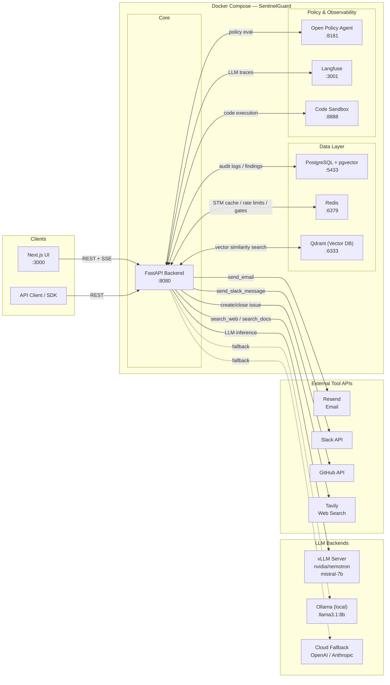
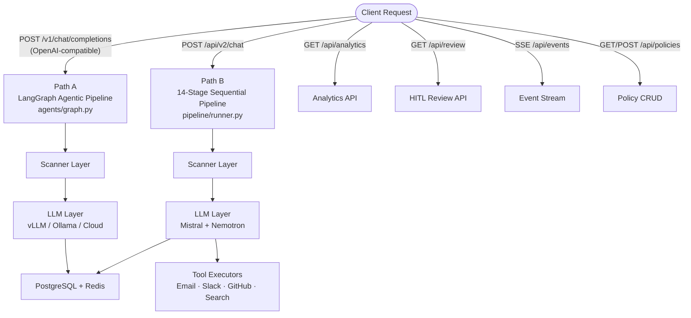
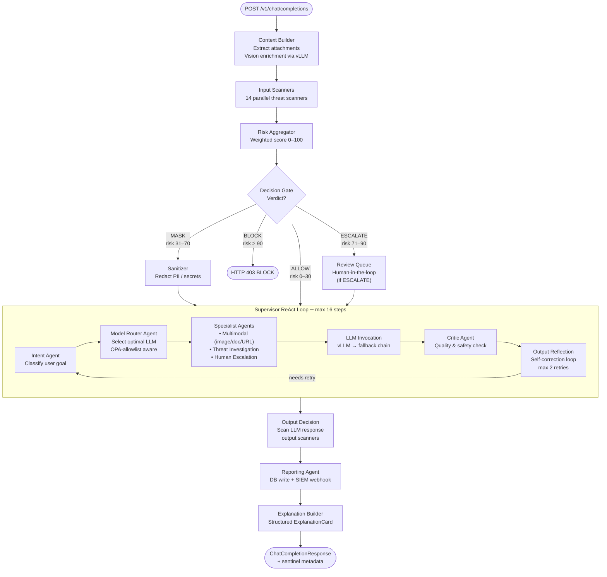
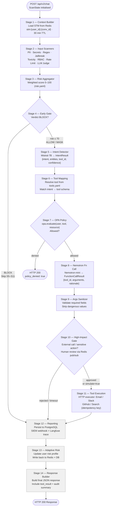
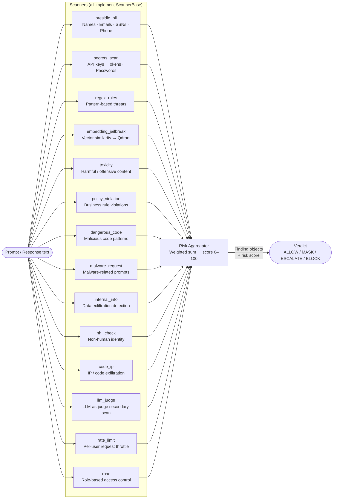
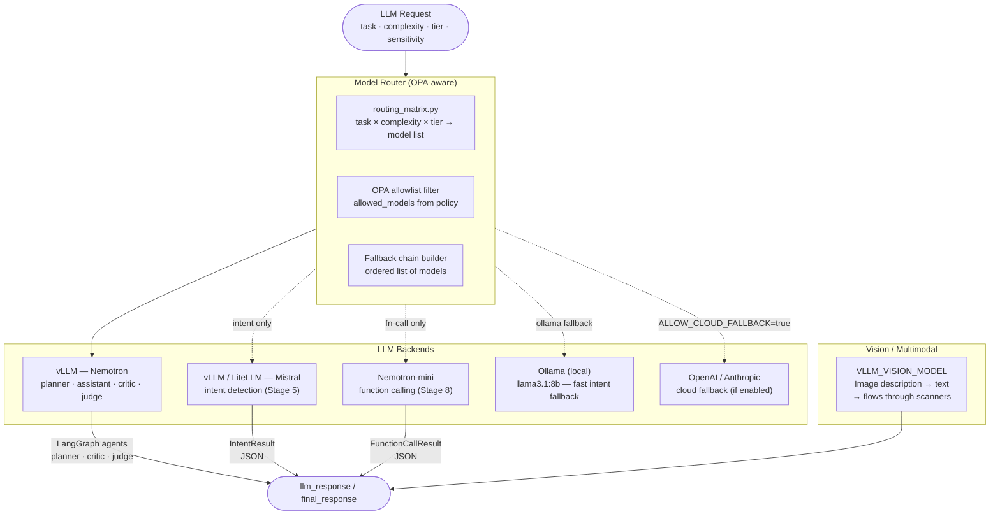
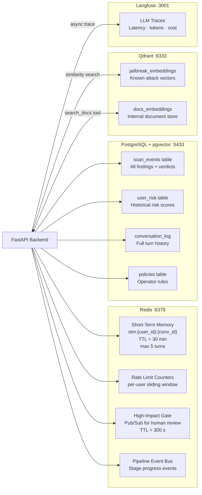
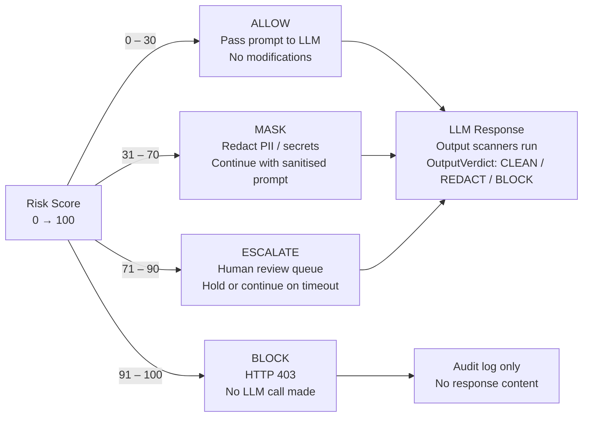

# SentinelGuard — Complete Architecture Reference

> **Project**: SentinelGuard — Agentic AI Security Gateway  
> **Version**: Sentinel-X Pipeline v2  
> **Stack**: FastAPI · LangGraph · LiteLLM/vLLM · OPA · PostgreSQL+pgvector · Redis · Qdrant · Next.js 15  
> **Updated**: 2026-05-04

---

## Table of Contents

1. [What is SentinelGuard?](#1-what-is-sentinelguard)
2. [High-Level System Architecture](#2-high-level-system-architecture)
3. [Infrastructure & Technology Stack](#3-infrastructure--technology-stack)
4. [Complete File Structure](#4-complete-file-structure)
5. [Core Data Model — ScanState](#5-core-data-model--scanstate)
6. [Request Lifecycle — End-to-End Flow](#6-request-lifecycle--end-to-end-flow)
7. [Agentic Pipeline — Sentinel-X (ReAct)](#7-agentic-pipeline--sentinel-x-react)
8. [14-Stage Sequential Pipeline (v2)](#8-14-stage-sequential-pipeline-v2)
9. [Scanner Subsystem (11 Input + 5 Output)](#9-scanner-subsystem-11-input--5-output)
10. [Risk Scoring Engine](#10-risk-scoring-engine)
11. [OPA Policy Engine](#11-opa-policy-engine)
12. [LLM Routing & Invocation](#12-llm-routing--invocation)
13. [Memory Subsystem](#13-memory-subsystem)
14. [Database Schema (10 Tables)](#14-database-schema-10-tables)
15. [Tool Ecosystem](#15-tool-ecosystem)
16. [Observability & Audit Trail](#16-observability--audit-trail)
17. [Configuration Reference](#17-configuration-reference)
18. [Deployment Topology](#18-deployment-topology)
19. [Architecture diagrams (Mermaid)](#19-architecture-diagrams-mermaid)

---

## 1. What is SentinelGuard?

SentinelGuard is an **enterprise-grade, agentic AI security gateway** that acts as an OpenAI-compatible proxy. Every request is intercepted before it reaches an LLM, and every response is intercepted before it reaches the client. Content is run through a multi-agent orchestration system to detect and mitigate security threats.

### Threat Coverage

| Threat Class | Detection Engine |
|---|---|
| Prompt injection / jailbreak | 30+ regex rules + embedding similarity + LLM judge |
| PII leakage (SSN, CC, passport…) | Microsoft Presidio (spaCy NLP) |
| Secrets & credentials | detect-secrets library + 15 regex patterns |
| Malware / dangerous code requests | Intent classifier + keyword matching |
| Policy violations | Open Policy Agent (Rego rules) |
| Toxic content | Detoxify ML classifier |
| RBAC violations | Role × resource × action matrix |
| Hallucinated dangerous instructions | Output reflection self-correction loop |
| Repeat attack patterns | pgvector episodic memory recall |
| Non-human identity abuse | NHI workload pattern detection |

### Key Design Decisions

- **OpenAI-compatible proxy**: Drop-in replacement — existing clients need zero changes.
- **Dual orchestration modes**: Agentic (Nemotron ReAct supervisor) and sequential (14-stage pipeline) — selectable per environment.
- **Self-hosted LLM first**: vLLM with Nemotron models; OpenAI/Anthropic/Ollama as fallbacks.
- **Policy-as-code**: OPA Rego for all access control, compliance, and intent gating — hot-reloadable.
- **Human-in-the-loop**: ReviewQueue for ESCALATE verdicts before high-impact actions execute.

---

## 2. High-Level System Architecture

```
╔═════════════════════════════════════════════════════════════════════╗
║                       CLIENT APPLICATIONS                           ║
║     (OpenAI SDK  /  REST  /  SSE streaming  /  Next.js Dashboard)   ║
╚═════════════════════════════════╤═══════════════════════════════════╝
                                  │  POST /api/v2/chat
                                  │  (or /v1/chat/completions)
                                  ▼
╔═════════════════════════════════════════════════════════════════════╗
║                    FastAPI Gateway  (port 8080)                     ║
║                                                                     ║
║  ┌──────────────┐ ┌──────────────┐ ┌──────────┐ ┌───────────────┐  ║
║  │  /api/chat   │ │ /api/v2/chat │ │ /events  │ │ /api/review   │  ║
║  │  (legacy)    │ │ (pipeline v2)│ │  (SSE)   │ │ /policies     │  ║
║  └──────┬───────┘ └──────┬───────┘ └────┬─────┘ │ /session      │  ║
║         │                │              │        └───────────────┘  ║
║         └────────────────▼──────────────┘                          ║
║                   graph.py · run_pipeline()                         ║
║              (Dispatcher: selects execution path)                   ║
╚═════════════════════════════════╤═══════════════════════════════════╝
                                  │
                 ┌────────────────┴────────────────┐
                 │                                 │
                 ▼                                 ▼
    ╔════════════════════════╗      ╔══════════════════════════╗
    ║   AGENTIC_MODE = true  ║      ║   PIPELINE_MODE = true   ║
    ║                        ║      ║                          ║
    ║  Sentinel-X ReAct      ║      ║  14-Stage Sequential     ║
    ║  Supervisor Loop       ║      ║  Pipeline                ║
    ║  (supervisor.py)       ║      ║  (pipeline/runner.py)    ║
    ╚════════════╤═══════════╝      ╚═════════════╤════════════╝
                 │                                │
                 └────────────────┬───────────────┘
                                  │  Shared: ScanState
                                  ▼
         ╔════════════════════════════════════════╗
         ║          Core Supporting Services       ║
         ║                                         ║
         ║  ┌──────────────┐  ┌─────────────────┐  ║
         ║  │   Scanners   │  │   OPA Policy    │  ║
         ║  │ 11 in + 5 out│  │   Engine        │  ║
         ║  └──────────────┘  └─────────────────┘  ║
         ║  ┌──────────────┐  ┌─────────────────┐  ║
         ║  │ LiteLLM/vLLM │  │   Redis STM +   │  ║
         ║  │   Client     │  │   SSE Streams   │  ║
         ║  └──────────────┘  └─────────────────┘  ║
         ║  ┌──────────────┐  ┌─────────────────┐  ║
         ║  │  PostgreSQL  │  │     Qdrant      │  ║
         ║  │  + pgvector  │  │   Vector DB     │  ║
         ║  └──────────────┘  └─────────────────┘  ║
         ╚════════════════════════════════════════╝
```

---

## 3. Infrastructure & Technology Stack

### docker-compose Services

```
Service          Image                      Port (host→container)   Role
────────────────────────────────────────────────────────────────────────
backend          python:3.12 (custom)       8080→8080               FastAPI API server
frontend         node:20 (custom)           3000→3000               Next.js dashboard
postgres         postgres:16+pgvector       5433→5432               Audit DB + embeddings
redis            redis:7                    6379→6379               STM + SSE event bus
opa              openpolicyagent:0.68.0     8181→8181               Policy engine sidecar
qdrant           qdrant:v1.9.4              6333→6333               Jailbreak corpus vectors
code-sandbox     python:3.12 (custom)       internal only           Sandboxed code execution
langfuse         langfuse:v2                3001→3001               LLM observability (opt.)
```

### Technology Rationale

| Layer | Technology | Why Chosen |
|---|---|---|
| API Framework | FastAPI + Pydantic v2 | Async-native, auto validation, OpenAPI docs |
| Orchestration | LangGraph shared state | Typed ScanState, resumable, auditable |
| LLM Inference | vLLM (Nemotron) + LiteLLM | Self-hosted GPU inference; LiteLLM unifies provider APIs |
| Policy Engine | Open Policy Agent (Rego) | Declarative, hot-reloadable, auditable decisions |
| Vector Store | pgvector + Qdrant | pgvector for audit/recall; Qdrant for high-speed similarity |
| Cache + Queue | Redis 7 Streams | Per-user STM, SSE fan-out, real-time event bus |
| PII Detection | Microsoft Presidio | Production-grade spaCy NLP entity recognition |
| Secrets Detection | detect-secrets + regex | Library precision + custom pattern coverage |
| Toxicity | Detoxify | Multi-label ML classifier (6 toxicity dimensions) |
| Migrations | Alembic + uv | Async-compatible, locked dependency tree |

---

## 4. Complete File Structure

```
Agentic ai/                              ← Project root
│
├── ARCHITECTURE.md                      ★ This file — definitive reference
├── docker-compose.yml                   # Full multi-service deployment
├── Makefile                             # build / test / migrate / seed targets
├── .env.example                         # Template — copy to .env and fill in
├── README.md
│
├── backend/
│   ├── Dockerfile                       # Multi-stage Python 3.12 image
│   ├── alembic.ini                      # Points to DATABASE_URL for migrations
│   ├── pipeline_config.yaml             # Per-stage enable/disable flags (v2)
│   ├── risk.yaml                        # Risk category weight overrides
│   ├── tools.yaml                       # Tool catalog: id, schema, impact level
│   ├── pyproject.toml                   # uv package manifest + dev deps
│   ├── uv.lock                          # Pinned, reproducible dependency tree
│   │
│   ├── alembic/                         # Database migration system
│   │   ├── env.py                       # Async SQLAlchemy env for Alembic
│   │   ├── script.py.mako               # Migration file template
│   │   └── versions/
│   │       ├── 0001_initial.py          # users, sessions, requests, finding_rows
│   │       ├── 0002_agent_traces.py     # agent_traces, audit_events
│   │       ├── 0003_pipeline_tables.py  # Pipeline v2 state tables
│   │       └── 0004_user_memory.py      # user_memory table
│   │
│   └── app/
│       ├── main.py               ★ FastAPI app factory, lifespan hooks, router mounts
│       ├── otel.py                      # OpenTelemetry span instrumentation
│       │
│       ├── api/                         # HTTP route handlers (thin layer)
│       │   ├── chat.py                  # POST /api/chat  — legacy agentic path
│       │   ├── pipeline_chat.py         # POST /api/v2/chat — 14-stage pipeline
│       │   ├── events.py                # GET  /api/events — SSE stream from Redis
│       │   ├── policies.py              # CRUD /api/policies
│       │   ├── review.py                # GET/POST /api/review — human queue UI
│       │   ├── session.py               # POST /api/session/start, /end
│       │   └── deps.py                  # FastAPI dependency injection helpers
│       │
│       ├── agents/                      # ★ Core orchestration — all agent logic
│       │   ├── graph.py          ★      # run_pipeline() dispatcher entry point
│       │   ├── supervisor.py     ★      # Nemotron ReAct supervisor loop
│       │   ├── threat.py                # Runs all 11 input scanners in parallel
│       │   ├── risk_aggregator.py       # Calls core/risk.py · aggregate()
│       │   ├── decision_gate.py         # score → ALLOW / MASK / ESCALATE / BLOCK
│       │   ├── context_builder.py       # Loads user row + session + historical risk
│       │   ├── model_router.py          # Selects LLM by intent/sensitivity/tier
│       │   ├── critic.py                # Validates model selection vs task needs
│       │   ├── llm_invoke.py            # Calls LLM with retry + fallback chain
│       │   ├── output_reflection.py     # Judge + self-correct LLM response loop
│       │   ├── output_decision.py       # output_findings → CLEAN / REDACT / BLOCK
│       │   ├── sanitizer.py             # Redacts PII/secrets from LLM response
│       │   ├── reporting.py      ★      # Persist DB + emit Redis SSE + SIEM webhook
│       │   ├── adaptive_risk.py         # Learns from verdicts, suggests policies
│       │   ├── review_queue.py          # Human-in-the-loop ESCALATE handler
│       │   ├── opa_policy.py            # Orchestrates all 5 OPA policy evaluations
│       │   ├── assistant.py             # LLM assistant response shaping
│       │   ├── explanation_builder.py   # Builds ExplanationCard from findings
│       │   ├── langgraph_workflow.py    # LangGraph integration stub
│       │   │
│       │   ├── memory/
│       │   │   └── episodic.py          # pgvector past-incident similarity recall
│       │   │
│       │   ├── parsers/
│       │   │   └── react_json.py        # Parses Nemotron ReAct JSON tool calls
│       │   │
│       │   ├── prompts/                 # LLM system prompts (not business logic)
│       │   │   ├── nemotron_supervisor.py            # Main ReAct supervisor prompt
│       │   │   ├── nemotron_function_call.py         # Arg extraction prompt
│       │   │   ├── mistral_intent.py                 # Intent classification prompt
│       │   │   ├── policy_pack_render.py             # Jinja2 policy pack renderer
│       │   │   ├── operator_policies.md              # Operator policy text
│       │   │   └── security_software_llm_guard_policies.yaml
│       │   │
│       │   ├── sandbox/
│       │   │   └── runner.py            # HTTP client to code-sandbox container
│       │   │
│       │   ├── specialists/             # Specialist agents (called via delegate_to_*)
│       │   │   ├── base.py              # classify_intent_json() fast intent path
│       │   │   ├── intent.py            # Intent classification specialist
│       │   │   ├── policy.py            # OPA + LLM contextual policy specialist
│       │   │   ├── multimodal.py        # Multimodal orchestrator
│       │   │   ├── mm_document.py       # PDF / DOCX document analyzer
│       │   │   ├── mm_image.py          # Image content analysis
│       │   │   ├── mm_url.py            # URL safety analysis
│       │   │   ├── mm_metadata.py       # File metadata extraction
│       │   │   ├── human_escalation.py  # Human escalation decision specialist
│       │   │   ├── threat_investigation.py
│       │   │   ├── model_router_agent.py
│       │   │   └── output_reflection_agent.py
│       │   │
│       │   └── tools/                   # Tool registry for supervisor
│       │       ├── base.py              # ToolResult dataclass
│       │       ├── registry.py   ★      # 20+ OpenAI tool schemas + dispatch()
│       │       └── security.py          # Scanner wrappers exposed as LLM tools
│       │
│       ├── core/                        # Business logic (no I/O)
│       │   ├── config.py         ★      # Settings: Pydantic + env vars (~60 options)
│       │   ├── risk.py           ★      # Weighted risk aggregation 0..100
│       │   ├── policies.py              # OPAClient HTTP wrapper (5 policy methods)
│       │   ├── logging.py               # structlog structured logger setup
│       │   ├── routing_matrix.py        # Static intent → model routing table
│       │   └── task_router.py           # Dynamic task classification router
│       │
│       ├── db/                          # Database access layer
│       │   ├── models.py         ★      # SQLAlchemy ORM — all 10 tables
│       │   ├── session.py               # AsyncSession factory
│       │   └── risk_graph.py            # Risk graph node/edge learning
│       │
│       ├── llm/                         # LLM client abstractions
│       │   ├── litellm_client.py ★      # Unified async client (vLLM primary)
│       │   ├── vllm_probe.py            # vLLM health check on startup
│       │   ├── vllm_state.py            # vLLM availability state singleton
│       │   └── vllm_url.py              # URL normalization utility
│       │
│       ├── memory/
│       │   └── stm.py            ★      # Redis STM: 30-min TTL, 5-turn window
│       │
│       ├── pipeline/                    # ★ 14-stage sequential pipeline
│       │   ├── base.py                  # Stage interface: async run(state) → state
│       │   ├── runner.py                # PipelineRunner: sequential orchestrator
│       │   ├── stage01_context_builder.py
│       │   ├── stage02_input_scanners.py
│       │   ├── stage03_risk_aggregator.py
│       │   ├── stage04_early_gate.py
│       │   ├── stage05_intent_detector.py
│       │   ├── stage06_tool_mapping.py
│       │   ├── stage07_opa_policy.py
│       │   ├── stage08_nemotron_fn_call.py
│       │   ├── stage09_args_sanitizer.py
│       │   ├── stage10_high_impact_gate.py
│       │   ├── stage11_tool_execution.py
│       │   ├── stage12_reporting.py
│       │   ├── stage13_adaptive_risk.py
│       │   └── stage14_response.py
│       │
│       ├── scanners/                    # ★ Security scanner implementations
│       │   ├── base.py                  # Scanner interface: async scan() → Finding[]
│       │   ├── presidio_pii.py          # PII detection (Presidio + regex fallback)
│       │   ├── secrets_scan.py          # Secrets (detect-secrets + 15 regex)
│       │   ├── regex_rules.py           # Injection/jailbreak (30+ patterns)
│       │   ├── embedding_jailbreak.py   # Sentence-transformer cosine similarity
│       │   ├── toxicity.py              # Detoxify multi-label classifier
│       │   ├── malware_request.py       # Malware intent keywords + patterns
│       │   ├── rbac.py                  # Role × resource access matrix
│       │   ├── code_ip.py               # Proprietary code / IP leakage
│       │   ├── dangerous_code.py        # Dangerous code patterns (AST + regex)
│       │   ├── internal_info.py         # Internal system information probes
│       │   ├── nhi_check.py             # Non-human identity workload detection
│       │   ├── policy_violation.py      # OPA-backed policy violations
│       │   ├── llm_judge.py             # LLM-as-judge scanner
│       │   ├── vector_recall.py         # pgvector similarity vs past blocks
│       │   ├── rate_limit.py            # Rate limiting enforcement
│       │   └── citation_validator.py    # Output: factual citation verification
│       │
│       ├── schemas/                     # Pydantic v2 models (shared types)
│       │   ├── sentinel.py       ★      # ScanState, Finding, Verdict, IntentResult
│       │   ├── openai.py                # OpenAI API request/response compatibility
│       │   └── explanation.py           # ExplanationCard schema
│       │
│       ├── services/
│       │   └── file_extract.py          # PDF / DOCX / image text extraction
│       │
│       └── tools/                       # Business action tools
│           ├── base.py                  # BaseTool interface
│           ├── registry.py              # Tool registry + lookup by tool_id
│           ├── email_tool.py            # Email via Resend API
│           ├── slack_tool.py            # Slack messages via Bot token
│           ├── github_tool.py           # GitHub issues / PRs via REST API
│           └── search_tool.py           # Web search via Tavily API
│
├── datasets/
│   ├── jailbreaks.jsonl                 # JailbreakBench corpus (pgvector seed)
│   └── red_team_dataset.jsonl           # Red-team evaluation attack prompts
│
└── infra/
    ├── opa/policies/                    # Open Policy Agent rules
    │   ├── sentinel.rego                # Base allow/deny from findings severity
    │   ├── access.rego                  # Role-based: tier × resource × action
    │   ├── compliance.rego              # GDPR, HIPAA, SOC2 data residency
    │   ├── intent.rego                  # Intent-based gating (e.g. email role)
    │   ├── models.rego                  # Allowed model list per tier
    │   ├── tools.rego                   # Tool authorization by impact level
    │   └── data.json                    # Static policy data (roles, tier rules)
    ├── postgres/
    │   └── init.sql                     # CREATE EXTENSION pgvector; schema init
    └── sandbox/
        ├── Dockerfile                   # Isolated Python sandbox image
        └── server.py                    # FastAPI code execution endpoint
```

> **★** marks the most critical files to understand first when onboarding.

---

## 5. Core Data Model — ScanState

`ScanState` in [backend/app/schemas/sentinel.py](backend/app/schemas/sentinel.py) is the **single shared state object** threaded through every agent, stage, and scanner. It is a Pydantic BaseModel acting as the LangGraph graph state — nothing is in function signatures, everything flows through this object.

```
ScanState
│
├── ── Request Identity ─────────────────────────────────────────
│   ├── request_id: str          UUID, generated per HTTP request
│   ├── conv_id: str             Conversation thread ID (Redis STM key)
│   ├── prompt: str              Raw user input text
│   ├── sensitivity: float       0.0–1.0 — contextual sensitivity hint
│   └── started_at: datetime
│
├── ── User Context ─────────────────────────────────────────────
│   └── user: UserContext
│       ├── user_id: str
│       ├── tier: str            free | pro | enterprise
│       ├── region: str          Data residency region (e.g. eu-west)
│       ├── auth_type: str       human | bot | service
│       ├── role: str            RBAC role (e.g. analyst, admin)
│       └── resource: str        Target resource being accessed
│
├── ── Short-Term Memory ────────────────────────────────────────
│   └── stm_context: dict        {last_intent, entities, last_tool,
│                                  last_args, last_result, turns[5]}
│
├── ── Scanner Findings ─────────────────────────────────────────
│   ├── findings: list[Finding]
│   │   └── Finding
│   │       ├── category: str    PII | INJECTION | SECRET | TOXICITY |
│   │       │                    MALWARE | RBAC | CODE_IP | DANGEROUS_CODE |
│   │       │                    INTERNAL_INFO | NHI | POLICY_VIOLATION
│   │       ├── severity: float  0.0–1.0
│   │       ├── scanner: str     Source scanner name
│   │       ├── evidence: str    Masked evidence string
│   │       └── metadata: dict   Scanner-specific extra data
│   ├── risk: float              0..100 aggregated risk score
│   └── verdict: Verdict         ALLOW | MASK | ESCALATE | BLOCK
│
├── ── Intent & Agentic ─────────────────────────────────────────
│   ├── intent: str              Classified intent label string
│   ├── intent_result: IntentResult
│   │   ├── intent: IntentType   SEND_EMAIL | CREATE_TICKET | SEARCH_DOCUMENTS
│   │   │                        | CREATE_PR | SEND_SLACK | GENERAL | …
│   │   ├── sub_intent: str      Refined sub-intent
│   │   ├── entities: dict       Extracted named entities
│   │   ├── tool_id: str         Mapped tool identifier
│   │   └── confidence: float    0.0–1.0
│   ├── fn_call_result: FunctionCallResult
│   │   ├── tool_id: str
│   │   ├── arguments: dict      Structured tool arguments (sanitized)
│   │   ├── idempotency_key: str Deduplication key for action tools
│   │   └── rationale: str       Nemotron's reasoning for argument choices
│   ├── agent_findings: list[dict]  Findings from agentic tool calls
│   ├── agent_steps: list[dict]     Full ReAct step trace (model + tools)
│   └── explanation: dict           ExplanationCard → rendered in frontend
│
├── ── LLM Invocation ───────────────────────────────────────────
│   ├── selected_model: str      Model chosen by model_router
│   ├── llm_response: str        Raw LLM output text
│   ├── output_findings: list[Finding]  From output scanner pass
│   └── output_verdict: OutputVerdict   CLEAN | REDACT | BLOCK
│
├── ── Final Output ─────────────────────────────────────────────
│   └── final_response: str      Sanitized response sent to client
│
└── ── Audit Trail ──────────────────────────────────────────────
    ├── audit_events: list[AuditEvent]
    ├── finished_at: datetime
    └── latency_ms: int
```

---

## 6. Request Lifecycle — End-to-End Flow

```
CLIENT
  │
  │  POST /api/v2/chat
  │  { model, messages[], user_id, conv_id }
  ▼
┌──────────────────────────────────────────────────┐
│  api/pipeline_chat.py                            │
│  1. Validate request (OpenAI schema)             │
│  2. Extract last user message → prompt           │
│  3. Build ScanState (request_id, user, prompt)   │
│  4. Load STM from Redis  → state.stm_context     │
│  5. Dispatch: run_pipeline(state)                │
└───────────────────────────┬──────────────────────┘
                            │
                            ▼
┌──────────────────────────────────────────────────┐
│  agents/graph.py · run_pipeline()                │
│                                                  │
│  PIPELINE_MODE=true  →  pipeline/runner.py       │
│  AGENTIC_MODE=true   →  run_agentic_pipeline()   │
│  (default=pipeline)                              │
└──────────┬───────────────────────────────────────┘
           │
     ┌─────┴──────┐
     │            │
     ▼            ▼
 §8 Pipeline   §7 Agentic
 (14 stages)   (ReAct loop)
     │            │
     └─────┬──────┘
           │  ScanState (fully populated)
           ▼
┌──────────────────────────────────────────────────┐
│  agents/reporting.py  (always runs)              │
│  1. INSERT Request row + embedding (pgvector)    │
│  2. INSERT FindingRow[] rows                     │
│  3. INSERT AgentTrace row (full step log)        │
│  4. INSERT AuditEvent[] rows                     │
│  5. XADD redis stream → SSE broadcast            │
│  6. POST SIEM webhook (if SIEM_WEBHOOK_URL set)  │
└───────────────────────────┬──────────────────────┘
                            │
                            ▼
┌──────────────────────────────────────────────────┐
│  api/pipeline_chat.py  (response builder)        │
│                                                  │
│  output_verdict = CLEAN  →  200  llm_response    │
│  output_verdict = REDACT →  200  sanitized +     │
│                              redacted_fields[]   │
│  output_verdict = BLOCK  →  403  explanation +   │
│                              risk score          │
│                                                  │
│  Update STM: last_intent, turns[]                │
│  Return OpenAI-compatible JSON                   │
└──────────────────────────────────────────────────┘
                            │
                            ▼
                         CLIENT
```

---

## 7. Agentic Pipeline — Sentinel-X (ReAct)

Activated when `AGENTIC_MODE=true`. The Nemotron supervisor runs a **ReAct (Reason + Act) loop** — it calls security tools iteratively until it has gathered enough evidence to emit an `explanation_card` and terminate.

```
agents/graph.py · run_agentic_pipeline(state)
│
├─ A. context_builder.py
│     SELECT users WHERE user_id=...
│     SELECT sessions WHERE user_id=...
│     Merge historical risk score
│     → state.user (UserContext populated)
│
├─ B. supervisor.py · run_react_loop_primary()
│     │
│     ├─ [PRE-SCAN]  if AGENT_PRESCAN = "full_threat"
│     │    threat.py · run_threat_detection()
│     │    asyncio.gather(*all 11 scanners)
│     │    → state.findings[]  (available to supervisor from step 1)
│     │
│     ├─ [EPISODIC RECALL]  agents/memory/episodic.py
│     │    SELECT requests WHERE embedding <-> current_embedding < 0.15
│     │    AND verdict IN ('BLOCK','ESCALATE')
│     │    LIMIT 5
│     │    Injected as context into supervisor system prompt
│     │
│     └─ [REACT LOOP]  max MAX_SUPERVISOR_STEPS=16 iterations
│          ┌──────────────────────────────────────────────────────┐
│          │  Each Iteration:                                      │
│          │                                                        │
│          │  1. Build messages[]                                   │
│          │     • system: nemotron_supervisor.py prompt            │
│          │     • user:   prompt + stm_context + past findings     │
│          │     • tools:  OPENAI_SUPERVISOR_TOOLS (20+ schemas)    │
│          │                                                        │
│          │  2. litellm_client.acomplete(messages, tools)          │
│          │     → Nemotron-3 on vLLM                               │
│          │                                                        │
│          │  3. Parse response                                      │
│          │     (a) tool_calls[] present   → dispatch tool(s)      │
│          │     (b) "explanation_card" in content → EXIT LOOP      │
│          │     (c) text only → store as assistant step, continue  │
│          │                                                        │
│          │  4. Tool dispatch  (tools/registry.py · dispatch())    │
│          │                                                        │
│          │     SCAN TOOLS          →  scanner wrappers            │
│          │     ┌─────────────────────────────────────────────┐   │
│          │     │ scan_pii          presidio_pii.py            │   │
│          │     │ scan_secrets      secrets_scan.py            │   │
│          │     │ scan_injection    regex_rules.py             │   │
│          │     │ scan_toxicity     toxicity.py                │   │
│          │     │ scan_malware      malware_request.py         │   │
│          │     │ scan_rbac         rbac.py                    │   │
│          │     │ scan_code_ip      code_ip.py                 │   │
│          │     │ scan_internal     internal_info.py           │   │
│          │     │ scan_nhi          nhi_check.py               │   │
│          │     │ run_full_scan     all 11 scanners            │   │
│          │     │ memory_recall     pgvector similarity        │   │
│          │     └─────────────────────────────────────────────┘   │
│          │                                                        │
│          │     SPECIALIST DELEGATES  →  sub-agent calls           │
│          │     ┌─────────────────────────────────────────────┐   │
│          │     │ delegate_to_intent      specialists/intent   │   │
│          │     │ delegate_to_policy      specialists/policy   │   │
│          │     │ delegate_to_multimodal  specialists/multimodal│  │
│          │     │ delegate_to_threat      threat_investigation  │  │
│          │     │ delegate_to_model_router model_router_agent  │   │
│          │     │ emit_explanation_card   → terminates loop    │   │
│          │     └─────────────────────────────────────────────┘   │
│          │                                                        │
│          │  5. Append ToolMessage result to messages[]            │
│          │  6. Append agent_step dict to state.agent_steps[]      │
│          └──────────────────────────────────────────────────────┘
│          [EXIT: emit_explanation_card called  OR  steps exhausted]
│          → state.agent_findings[], state.explanation
│
├─ C. risk_aggregator.py
│     core/risk.py · aggregate(state.findings + state.agent_findings)
│     → state.risk (0..100)
│
├─ D. decision_gate.py
│     risk ≤ RISK_ALLOW_MAX(30)    → ALLOW
│     risk ≤ RISK_MASK_MAX(70)     → MASK
│     risk ≤ RISK_ESCALATE_MAX(90) → ESCALATE
│     risk >  90                   → BLOCK
│     → state.verdict
│
├─ E. opa_policy.py  (calls specialists/policy.py)
│     Evaluates 5 OPA policies in sequence:
│     sentinel → access → compliance → intent → models
│     May upgrade verdict to ESCALATE or BLOCK
│     → state.agent_findings += PolicyDecisionRecord[]
│
├─ [BLOCK?] ─────────────────────────────────── skip F–K → go to L
│
├─ F. model_router.py
│     Select model: intent + sensitivity + tier + complexity
│     → state.selected_model
│
├─ G. critic.py
│     Validate: does selected model have required capabilities?
│     May swap model if unsuitable
│
├─ H. review_queue.py
│     IF verdict = ESCALATE:
│       INSERT review_queue_items (status=PENDING)
│       Poll for human decision (timeout=REVIEW_TIMEOUT_SECONDS)
│       APPROVED → continue  |  DENIED / TIMEOUT → BLOCK
│
├─ I. llm_invoke.py
│     acomplete(prompt, model=state.selected_model)
│     Fallback chain: vLLM → OpenAI → Anthropic → Ollama
│     → state.llm_response
│
├─ J. output_reflection.py  (loop, max MAX_REFLECTION_STEPS=3)
│     Run 5 output scanners on state.llm_response
│     BLOCK  → regenerate with tighter constraints
│     REDACT → sanitizer.py masks PII/secrets in response
│     CLEAN  → accept
│     → state.output_findings[], state.output_verdict
│
├─ K. output_decision.py
│     Map output_findings → OutputVerdict
│     → state.final_response
│
└─ L. reporting.py + adaptive_risk.py
      Persist, emit SSE, learn, suggest policies
```

---

## 8. 14-Stage Sequential Pipeline (v2)

Activated when `PIPELINE_MODE=true`. Deterministic, inspectable, per-stage toggleable execution via `pipeline_config.yaml`.

**Rules:**
- BLOCK at Stage 4 → stages 5–11 are **skipped**
- Stages 12–14 **always execute** regardless of verdict (audit guarantee)

```
PipelineRunner · pipeline/runner.py
│
Stage 01 · context_builder.py
  Input:   state.user.user_id
  Action:  SELECT User + Session; merge historical risk_score
           Load Redis STM → state.stm_context
  Output:  state.user (fully populated), state.stm_context
  ─────────────────────────────────────────────────────────
Stage 02 · input_scanners.py
  Input:   state.prompt
  Action:  asyncio.gather(*11 scanners)  ← all run in parallel
  ┌─────────────────────────────────────────────────────┐
  │  1.  presidio_pii         PII entities               │
  │  2.  secrets_scan         API keys, creds, tokens    │
  │  3.  regex_rules          Injection / jailbreak      │
  │  4.  embedding_jailbreak  Cosine vs corpus (0.85)    │
  │  5.  toxicity             Detoxify 6-label score     │
  │  6.  malware_request      Malware intent patterns    │
  │  7.  rbac                 Role × resource matrix     │
  │  8.  code_ip              Proprietary code / IP      │
  │  9.  dangerous_code       AST + regex dangerous pats │
  │  10. internal_info        System config probes       │
  │  11. nhi_check            Non-human identity checks  │
  └─────────────────────────────────────────────────────┘
  Output:  state.findings[]
  ─────────────────────────────────────────────────────────
Stage 03 · risk_aggregator.py
  Input:   state.findings[]
  Action:  core/risk.py · aggregate()
           Weighted sum + scanner bonus + historical × 0.1
  Output:  state.risk  (0..100)
  ─────────────────────────────────────────────────────────
Stage 04 · early_gate.py                  ← EARLY EXIT POINT
  Input:   state.risk, state.findings (severity check)
  Action:  IF risk > ALLOW_MAX AND any severity > 0.8:
             state.verdict = BLOCK  → triggers short-circuit
           Skips expensive LLM stages for obvious blocks
  Output:  state.verdict
  ─────────────────────────────────────────────────────────
Stage 05 · intent_detector.py
  Input:   state.prompt
  Action:  litellm_client.acomplete_intent_fast()
           Model: Mistral (or Ollama mistral if configured)
           Prompt: prompts/mistral_intent.py
  Output:  state.intent_result (IntentResult)
           intent = SEND_EMAIL | SEARCH_DOCUMENTS | CREATE_TICKET
                  | CREATE_PR | SEND_SLACK | GENERAL | …
  ─────────────────────────────────────────────────────────
Stage 06 · tool_mapping.py
  Input:   state.intent_result.intent + tool_id
  Action:  Lookup tools.yaml by intent → ToolSpec
           Match IntentType → tool_id → {schema, impact_level}
  Output:  state.tool_id, state.tool_spec
  ─────────────────────────────────────────────────────────
Stage 07 · opa_policy.py
  Input:   state.user, state.intent_result, state.tool_id
  Action:  OPAClient.check_tool(tool_id, user_context)
           OPAClient.decide_intent_rules(intent)
           OPAClient.decide_access(user, resource)
  Output:  state.verdict  (may upgrade to BLOCK)
           state.agent_findings += PolicyDecisionRecord
  ─────────────────────────────────────────────────────────
Stage 08 · nemotron_fn_call.py
  Input:   state.prompt, state.intent_result, state.tool_spec
  Action:  litellm_client.acomplete() with Nemotron model
           Prompt: prompts/nemotron_function_call.py
           Function-calling API → structured argument extraction
  Output:  state.fn_call_result
           { tool_id, arguments{}, idempotency_key, rationale }
  ─────────────────────────────────────────────────────────
Stage 09 · args_sanitizer.py
  Input:   state.fn_call_result.arguments (dict)
  Action:  Run presidio_pii + secrets_scan on each arg value
           Redact if severity > redaction_threshold
  Output:  state.fn_call_result.arguments  (sanitized in-place)
  ─────────────────────────────────────────────────────────
Stage 10 · high_impact_gate.py            ← HUMAN REVIEW POINT
  Input:   state.tool_spec.impact_level, state.risk
  Action:  IF impact_level = "high" OR risk > ESCALATE_MAX:
             INSERT review_queue_items (PENDING)
             Poll until APPROVED | DENIED | TIMEOUT
             DENIED or TIMEOUT → state.verdict = BLOCK
  Output:  state.verdict
  ─────────────────────────────────────────────────────────
Stage 11 · tool_execution.py
  Input:   state.fn_call_result (tool_id + arguments)
  Action:  tools/registry.py · execute(tool_id, arguments)
           Dispatches to: email / slack / github / search tool
           Captures result or error
  Output:  state.tool_result
           state.agent_findings += ToolExecutionRecord
  ─────────────────────────────────────────────────────────
Stage 12 · reporting.py                   ← ALWAYS RUNS
  Input:   Full ScanState
  Action:  INSERT Request + FindingRow[] + AgentTrace + AuditEvent[]
           Compute pgvector embedding (all-MiniLM-L6-v2)
           XADD redis stream → SSE event to frontend
           POST SIEM webhook if SIEM_WEBHOOK_URL configured
  Output:  state.audit_events[]
  ─────────────────────────────────────────────────────────
Stage 13 · adaptive_risk.py               ← ALWAYS RUNS
  Input:   state.verdict, state.findings, state.risk
  Action:  UPDATE risk_graph_nodes / edges (learning)
           IF risk > threshold: suggest new Rego policy
           Adjust per-user historical risk score
  Output:  Updated risk graph; optional policy suggestions
  ─────────────────────────────────────────────────────────
Stage 14 · response.py                    ← ALWAYS RUNS
  Input:   Full ScanState
  Action:  Format final API response based on output_verdict:
           CLEAN  → { response: llm_response }
           REDACT → { response: sanitized, redacted_fields: [...] }
           BLOCK  → { error: "blocked", explanation: card, risk: N }
  Output:  state.final_response  (JSON string returned to client)
```

---

## 9. Scanner Subsystem (11 Input + 5 Output)

### Scanner Interface

```python
# scanners/base.py
class BaseScanner:
    async def scan(self, text: str, context: UserContext) -> list[Finding]: ...
```

### Input Scanners — Detail

```
┌───────────────────────┬───────────────────────────────────────────────────────┐
│ Scanner               │ Detection Method & Key Signals                        │
├───────────────────────┼───────────────────────────────────────────────────────┤
│ presidio_pii          │ Presidio AnalyzerEngine with spaCy en_core_web_lg      │
│                       │ Entity severity weights:                               │
│                       │   SSN=1.0  CC=1.0  IBAN=0.9  PASSPORT=0.9             │
│                       │   IP_ADDR=0.5  EMAIL=0.4  PHONE=0.4  PERSON=0.3       │
│                       │ redact() → (masked_text, redaction_map)               │
│                       │ Fallback: regex patterns if Presidio unavailable       │
├───────────────────────┼───────────────────────────────────────────────────────┤
│ secrets_scan          │ detect-secrets library (Yelp) + 15 custom regex       │
│                       │ Patterns: OPENAI_KEY sk-…, AWS_KEY AKIA…,             │
│                       │   GH_PAT ghp_…, SLACK_BOT xoxb-…, STRIPE sk_live_…,  │
│                       │   JWT eyJ…, RSA_PRIVATE -----BEGIN RSA…,              │
│                       │   SENDGRID, TWILIO, AZURE_CS, GENERIC_SECRET          │
│                       │ Evidence masked: first4 + **** + last4                │
├───────────────────────┼───────────────────────────────────────────────────────┤
│ regex_rules           │ 30+ compiled regex patterns, 4 categories:            │
│                       │   PROMPT_INJECTION: "ignore previous instructions",   │
│                       │     "disregard all", "override your instructions"     │
│                       │   ROLE_OVERRIDE: "act as admin", "from now on",       │
│                       │     "pretend you are", "you are now"                  │
│                       │   JAILBREAK: "DAN", "jailbroken", "no restrictions",  │
│                       │     "developer mode", "unrestricted"                  │
│                       │   SYSTEM_EXTRACT: "reveal system prompt",             │
│                       │     "show your instructions", "what are you told"     │
├───────────────────────┼───────────────────────────────────────────────────────┤
│ embedding_jailbreak   │ sentence-transformers all-MiniLM-L6-v2 (384-dim)      │
│                       │ Cosine similarity vs JailbreakBench corpus             │
│                       │   stored in pgvector (jailbreak_embeddings table)     │
│                       │ Threshold: similarity ≥ 0.85 → JAILBREAK finding      │
│                       │ Catches paraphrased / obfuscated jailbreaks           │
├───────────────────────┼───────────────────────────────────────────────────────┤
│ toxicity              │ Detoxify model (multilabel classification)             │
│                       │ Labels: toxic / severe_toxic / obscene /              │
│                       │         identity_attack / insult / threat             │
│                       │ severity = max(all label scores)                      │
├───────────────────────┼───────────────────────────────────────────────────────┤
│ malware_request       │ Keyword matching + intent classification               │
│                       │ Signals: ransomware, keylogger, backdoor, rootkit,    │
│                       │   RAT, exploit, CVE-XXXX-XXXX, shellcode, C2 server  │
├───────────────────────┼───────────────────────────────────────────────────────┤
│ rbac                  │ User role × requested resource × action matrix        │
│                       │ Static rules + OPA access.rego for dynamic rules      │
│                       │ Checks: does role allow action on resource?           │
├───────────────────────┼───────────────────────────────────────────────────────┤
│ code_ip               │ Regex: copyright headers, customer ID patterns,       │
│                       │   internal CIDR ranges, proprietary code comments,    │
│                       │   internal hostnames, trade secret markers            │
├───────────────────────┼───────────────────────────────────────────────────────┤
│ dangerous_code        │ AST-level analysis + regex patterns                   │
│                       │ Signals: os.system(), subprocess.*, eval(), exec(),   │
│                       │   shutil.rmtree(), glob rm -rf, network sockets,      │
│                       │   privilege escalation patterns                       │
├───────────────────────┼───────────────────────────────────────────────────────┤
│ internal_info         │ Detects probes for: env vars, DB connection strings,  │
│                       │   /etc/passwd, /proc/*, internal API endpoints,       │
│                       │   employee PII, internal IP ranges, config files      │
├───────────────────────┼───────────────────────────────────────────────────────┤
│ nhi_check             │ Non-human identity detection:                         │
│                       │   service accounts, M2M auth tokens, CI/CD bots,     │
│                       │   scheduled job identities, automated pipelines       │
│                       │ Validates against an allowed NHI allowlist            │
└───────────────────────┴───────────────────────────────────────────────────────┘
```

### Output Scanners — Applied After LLM Response

Applied in `output_reflection.py` loop on `state.llm_response`:

| Scanner | Checks |
|---|---|
| `presidio_pii` | PII accidentally included in LLM response |
| `secrets_scan` | API keys / tokens in generated code snippets |
| `regex_rules` | Injection artifacts carried through from prompt |
| `toxicity` | Toxic content generated by the LLM |
| `citation_validator` | Factual citation verification (hallucination check) |

---

## 10. Risk Scoring Engine

Source: [backend/app/core/risk.py](backend/app/core/risk.py)

### Category Weights

```python
CATEGORY_WEIGHTS = {
    "PROMPT_INJECTION":  30,   # Instruction override attempts
    "JAILBREAK":         30,   # Model constraint bypasses
    "MALWARE":           35,   # Highest — code weaponization
    "RBAC_VIOLATION":    32,   # Unauthorized resource access
    "DANGEROUS_CODE":    33,   # Near-malware code requests
    "SECRET":            28,   # Credential exposure
    "POLICY_VIOLATION":  30,   # Rego rule failures
    "INTERNAL_INFO":     27,   # Internal system probes
    "PII":               25,   # Privacy violations
    "NHI":               25,   # Non-human identity abuse
    "CODE_IP":           22,   # IP leakage (lower since often accidental)
    "TOXICITY":          20,   # Lowest — context-dependent
}
```

### Aggregation Formula

```
For each finding f in state.findings[]:

  base  = CATEGORY_WEIGHTS[f.category] × f.severity

  bonus = +3  if f.scanner in {"embedding_jailbreak", "llm_judge"}
               (ML-based scanners have lower false positive rate)
          +2  if f.scanner == "presidio_pii"
               (Presidio NLP more precise than regex)
          +0  otherwise

  contribution = base + bonus

risk_raw = Σ(all contributions)

historical  = user.risk_score × 0.1      # max +10 from prior behavior

risk = min(100,  risk_raw + historical)
```

### Verdict Decision

```
Score Range    Verdict     Action
───────────────────────────────────────────────────────────
  0  – 30      ALLOW       Pass prompt to LLM unchanged
 31  – 70      MASK        Sanitize findings, pass to LLM
 71  – 90      ESCALATE    Queue for human review before proceeding
 91  – 100     BLOCK       Reject immediately, return explanation

Thresholds:  RISK_ALLOW_MAX=30  RISK_MASK_MAX=70  RISK_ESCALATE_MAX=90
             (all configurable via environment variables)
```

---

## 11. OPA Policy Engine

OPA runs as a sidecar container at `opa:8181`. The backend queries it via HTTP using `core/policies.py · OPAClient`.

### Policy Files

```
infra/opa/policies/
├── sentinel.rego     Base allow/deny: high finding severity → deny
├── access.rego       Role-based: tier × resource × action matrix
├── compliance.rego   Regulatory: GDPR region, HIPAA data type, SOC2
├── intent.rego       Intent-gating: SEND_EMAIL requires "email" role
├── models.rego       Model allowlist per tier (free → nano models only)
└── tools.rego        Tool authorization: tool_id × user × impact_level
```

### Evaluation Flow

```
OPAClient (core/policies.py)
│
├── evaluate(policy_path, input)
│    POST http://opa:8181/v1/data/{policy_path}
│    → { result: true | false }
│
├── decide(state)               → queries sentinel.rego
├── decide_access(user, res)    → queries access.rego
├── decide_compliance(types, r) → queries compliance.rego
├── decide_intent_rules(intent) → queries intent.rego
├── allowed_models(tier)        → queries models.rego
└── check_tool(tool_id, user)   → queries tools.rego

Fail-open: OPA unavailable → returns allow=True
           (configurable: OPA_FAIL_OPEN=true|false)
```

---

## 12. LLM Routing & Invocation

### Model Selection

```
agents/model_router.py  +  core/routing_matrix.py
│
├── Inputs:
│    intent_result.intent     task type (email, search, code, …)
│    state.sensitivity        0.0–1.0 content sensitivity
│    user.tier                free | pro | enterprise
│    findings complexity      count + max severity of findings
│
├── Routing Matrix:
│    HIGH sensitivity  + enterprise  →  nemotron-large
│    MODERATE sensitivity            →  nemotron-mini
│    LOW sensitivity   + free tier   →  nemotron-nano
│    CODING intent                   →  code-specialized model
│    MULTIMODAL content              →  vision-capable model
│
└── OPA Override: models.rego can restrict allowed models per tier
```

### LLM Client

```
llm/litellm_client.py
│
├── Primary:  vLLM (VLLM_BASE_URL)
│    LiteLLM string: "openai/{model}"
│    vLLM exposes OpenAI-compatible API
│
├── Fallback chain (if vLLM unavailable or overloaded):
│    1.  OpenAI API    (OPENAI_API_KEY)
│    2.  Anthropic API (ANTHROPIC_API_KEY)
│    3.  Ollama local  (OLLAMA_BASE_URL)
│
├── Intent fast path  acomplete_intent_fast():
│    Uses Ollama mistral (if OLLAMA_INTENT_MODEL configured)
│    Falls back to vLLM VLLM_INTENT_MODEL
│    temperature=0.1, max_tokens=128 (fast, deterministic)
│
└── Observability:
     LANGFUSE_ENABLED → LiteLLM callback → Langfuse trace per call
     OpenTelemetry span wraps every acomplete() call
```

---

## 13. Memory Subsystem

Two complementary memory systems provide temporal context across requests.

### Short-Term Memory (STM) — Redis

```
memory/stm.py · RedisSTM
│
├── Storage key:   "stm:{user_id}:{conv_id}"
├── TTL:           1800 seconds (30 min), sliding on every read/write
├── Max turns:     5  (configurable: STM_MAX_TURNS)
│
├── Stored fields per conversation:
│    last_intent    → most recent classified IntentType
│    entities       → named entities extracted from last turn
│    last_tool      → last tool_id executed
│    last_args      → last tool arguments (sanitized)
│    last_result    → tool result summary (truncated)
│    turns[]        → [{role, content}] sliding window
│
├── Redaction before storage:
│    Strips any field name containing:  password | token | secret | api_key
│    Prevents credential persistence across sessions
│
└── Pipeline integration:
     Stage 01 reads STM  → state.stm_context
     Nemotron supervisor injects stm_context into system prompt
     Stage 14 writes updated turns back to Redis
```

### Episodic / vector recall — pgvector

```
scanners/vector_recall.py · requests.embedding (pgvector)
│
├── Embeddings: sentence-transformers (same space as jailbreak / audit rows)
├── Recall: similarity search over past requests with BLOCK / ESCALATE verdicts
│
└── Effect: findings from similar past incidents raise risk; adaptive_risk.py
     uses repeat patterns to adjust user risk scores
```

---

## 14. Database Schema (10 Tables)

Managed by Alembic (4 versioned migrations in `backend/alembic/versions/`).

```
users
  id            SERIAL PK
  user_id       TEXT UNIQUE
  tier          TEXT              free | pro | enterprise
  region        TEXT              data residency
  risk_score    FLOAT             historical risk (0..100), updated by adaptive_risk
  attrs         JSONB             arbitrary user metadata
  created_at    TIMESTAMPTZ
  updated_at    TIMESTAMPTZ

sessions
  id            SERIAL PK
  user_id       TEXT FK → users.user_id
  session_id    TEXT UNIQUE
  request_count INT
  last_seen_at  TIMESTAMPTZ

requests                          ← Central audit table; every call writes here
  id            SERIAL PK
  request_id    UUID UNIQUE       Matches ScanState.request_id
  user_id       TEXT FK
  prompt        TEXT              Original user prompt
  response      TEXT              Final response sent (may be redacted)
  risk          FLOAT             Aggregated risk score 0..100
  verdict       TEXT              ALLOW | MASK | ESCALATE | BLOCK
  embedding     VECTOR(384)       pgvector — for episodic recall
  latency_ms    INT
  created_at    TIMESTAMPTZ

finding_rows                      ← One row per Finding in requests.findings[]
  id            SERIAL PK
  request_id    UUID FK → requests.request_id
  category      TEXT              PII | INJECTION | SECRET | …
  scanner       TEXT              Scanner that produced this finding
  severity      FLOAT             0.0–1.0
  evidence      TEXT              Masked evidence string
  extra         JSONB             Scanner-specific metadata

policies
  id            SERIAL PK
  name          TEXT
  rego          TEXT              Rego policy source code
  enabled       BOOL
  suggested     BOOL              true = proposed by adaptive_risk.py
  created_at    TIMESTAMPTZ

review_queue_items
  id            SERIAL PK
  request_id    UUID FK
  user_id       TEXT
  status        TEXT              PENDING | APPROVED | DENIED | TIMEOUT
  reason        TEXT              Human reviewer comment
  reviewed_by   TEXT              Reviewer user_id
  created_at    TIMESTAMPTZ
  updated_at    TIMESTAMPTZ

risk_graph_nodes
  id            SERIAL PK
  node_type     TEXT              user | intent | scanner | tool
  node_id       TEXT              Identifier within type
  risk_score    FLOAT             Learned risk for this node
  visit_count   INT

risk_graph_edges
  id            SERIAL PK
  source_node_id INT FK
  target_node_id INT FK
  weight        FLOAT             Transition weight (updated on verdict)
  created_at    TIMESTAMPTZ

jailbreak_embeddings              ← Jailbreak corpus for embedding scanner
  id            SERIAL PK
  text          TEXT              Jailbreak prompt text
  embedding     VECTOR(384)       pgvector
  source        TEXT              JailbreakBench | custom

audit_events
  id            SERIAL PK
  request_id    UUID FK
  event_type    TEXT              pipeline_start | stage_complete | verdict | …
  payload       JSONB             Event-specific data
  created_at    TIMESTAMPTZ

user_memory                       ← Long-term per-user conversation store
  id            SERIAL PK
  user_id       TEXT FK
  conv_id       TEXT
  content       JSONB             Structured memory content
  created_at    TIMESTAMPTZ

agent_traces                      ← Full agentic execution trace
  id            SERIAL PK
  request_id    UUID FK
  agent_steps   JSONB[]           Every ReAct step: model input/output/tool calls
  assistant_steps JSONB[]
  explanation   JSONB             ExplanationCard rendered in frontend
  agent_findings JSONB[]          Findings produced by agentic tools
  created_at    TIMESTAMPTZ
```

---

## 15. Tool Ecosystem

### Security Tools (available to Nemotron supervisor via function-calling)

Defined as OpenAI tool schemas in [backend/app/agents/tools/registry.py](backend/app/agents/tools/registry.py).

```
Tool ID                    Implemented In              What It Does
──────────────────────────────────────────────────────────────────────────────
scan_pii                   agents/tools/security.py    Presidio PII detection
scan_secrets               agents/tools/security.py    Secrets / credential scan
scan_injection             agents/tools/security.py    Regex injection / jailbreak
scan_toxicity              agents/tools/security.py    Detoxify toxicity score
scan_malware               agents/tools/security.py    Malware intent detection
scan_rbac                  agents/tools/security.py    RBAC violation check
scan_code_ip               agents/tools/security.py    Proprietary code / IP leak
scan_internal              agents/tools/security.py    Internal info probe check
scan_nhi                   agents/tools/security.py    Non-human identity check
run_full_input_scan        agents/tools/security.py    All 11 scanners in parallel
memory_recall_similar      agents/tools/security.py    pgvector past-incident recall
delegate_to_intent         specialists/intent.py       Intent classification
delegate_to_policy         specialists/policy.py       OPA + LLM policy evaluation
delegate_to_multimodal     specialists/multimodal.py   Document/image/URL analysis
delegate_to_threat         specialists/threat_invest.  Deep threat investigation
delegate_to_model_router   specialists/model_router_agent  Model selection
emit_explanation_card      agents/tools/registry.py    Terminate loop + emit card
```

### Business Action Tools

Defined in [backend/app/tools/](backend/app/tools/) — executed at Stage 11.

```
Tool ID    File              External API        Impact   Requires Human Review?
───────────────────────────────────────────────────────────────────────────────
email      email_tool.py     Resend API          HIGH     Yes — Stage 10 gate
slack      slack_tool.py     Slack Bot API       HIGH     Yes — Stage 10 gate
github     github_tool.py    GitHub REST API     HIGH     Yes — Stage 10 gate
search     search_tool.py    Tavily Search API   LOW      No
```

---

## 16. Observability & Audit Trail

### Real-Time SSE Events

```
Redis Stream key: "sentinel:events"

Producer  →  agents/reporting.py · XADD
  Payload per event:
  {
    request_id:      UUID
    risk:            0..100
    verdict:         ALLOW | MASK | ESCALATE | BLOCK
    findings_count:  int
    intent:          classified intent label
    latency_ms:      int
    timestamp:       ISO-8601
  }

Consumer  →  api/events.py · GET /api/events
  Content-Type: text/event-stream  (SSE)
  Frontend subscribes via: frontend/lib/sse.ts
  Rendered in: frontend/components/LiveFeed.tsx
```

### Database Audit — Per Request

```
Every request produces exactly:
  1 × Request row          (prompt, response, risk, verdict, embedding)
  N × FindingRow rows      (N = total findings from all scanners)
  1 × AgentTrace row       (full ReAct step log, explanation card)
  M × AuditEvent rows      (pipeline_start, stage_N_complete, verdict_set, …)
```

### Langfuse LLM Tracing (optional)

```
Environment:  LANGFUSE_ENABLED=true  +  PUBLIC_KEY  +  SECRET_KEY
LiteLLM callback sends to http://langfuse:3001

Per LLM call:
  • model name, prompt, response, token counts
  • latency, estimated cost
  • Custom tags: request_id, user_id, verdict, pipeline_stage
```

### OpenTelemetry

`app/otel.py` instruments:
- HTTP request/response spans (FastAPI middleware)
- Async DB query spans (SQLAlchemy)
- Custom spans per pipeline stage

---

## 17. Configuration Reference

All settings in [backend/app/core/config.py](backend/app/core/config.py) as a Pydantic `Settings` class. Values read from `.env` file.

```
── LLM ────────────────────────────────────────────────────────────────────────
VLLM_BASE_URL              required      Primary vLLM inference server URL
VLLM_PLANNER_MODEL         nemotron-nano Supervisor / planner model
VLLM_INTENT_MODEL          nemotron-nano Fast intent classification model
VLLM_API_KEY               optional      vLLM authentication key
OLLAMA_BASE_URL            optional      Ollama server (takes precedence for intent)
OLLAMA_INTENT_MODEL        mistral       Ollama intent model name
OPENAI_API_KEY             optional      OpenAI fallback
ANTHROPIC_API_KEY          optional      Anthropic fallback

── Pipeline Behavior ──────────────────────────────────────────────────────────
AGENTIC_MODE               true          Use Sentinel-X ReAct supervisor
PIPELINE_MODE              true          Use 14-stage sequential pipeline
SUPERVISOR_MODE            react_primary react_primary | legacy_parallel_crew
AGENT_PRESCAN              full_threat   full_threat | minimal | none
MAX_SUPERVISOR_STEPS       16            ReAct loop iteration limit
MAX_REFLECTION_STEPS       3             Output reflection loop limit

── Risk Thresholds ────────────────────────────────────────────────────────────
RISK_ALLOW_MAX             30            ≤ this → ALLOW
RISK_MASK_MAX              70            ≤ this → MASK
RISK_ESCALATE_MAX          90            ≤ this → ESCALATE  (> 90 → BLOCK)

── Infrastructure ─────────────────────────────────────────────────────────────
DATABASE_URL               required      postgresql+asyncpg://…
REDIS_URL                  required      redis://localhost:6379/0
OPA_URL                    http://opa:8181
QDRANT_URL                 http://qdrant:6333
OPA_FAIL_OPEN              true          Allow if OPA unreachable

── Memory ─────────────────────────────────────────────────────────────────────
STM_TTL_SECONDS            1800          Redis STM expiry (sliding)
STM_MAX_TURNS              5             Conversation history window
REVIEW_TIMEOUT_SECONDS     30            Human review poll timeout

── Business Tools ─────────────────────────────────────────────────────────────
RESEND_API_KEY             optional      Email via Resend
TAVILY_API_KEY             optional      Web search via Tavily
SLACK_BOT_TOKEN            optional      Slack via Bot token
GITHUB_TOKEN               optional      GitHub REST API

── Observability ──────────────────────────────────────────────────────────────
LANGFUSE_ENABLED           false
LANGFUSE_PUBLIC_KEY        optional
LANGFUSE_SECRET_KEY        optional
LANGFUSE_HOST              http://langfuse:3001
SIEM_WEBHOOK_URL           optional      POST target for security alerts

── Pipeline v2 Models ─────────────────────────────────────────────────────────
MISTRAL_MODEL              mistral-7b-instruct    Stage 05 intent detection
NEMOTRON_MODEL             nemotron-mini-4b-inst  Stage 08 function-call gen
```

---

## 18. Deployment Topology

```
Internet / Internal Network
          │
          ▼
  ┌───────────────┐
  │ Load Balancer │  nginx / Traefik / cloud ALB
  └───────┬───────┘
          │
    ┌─────┴──────────────────────┐
    │                            │
    ▼                            ▼
┌──────────┐              ┌──────────────┐
│ Frontend │              │   Backend    │
│ :3000    │◄──REST/SSE──►│   :8080      │
│ Next.js  │              │   FastAPI    │
└──────────┘              └──────┬───────┘
                                 │
           ┌─────────────────────┼───────────────────────┐
           │                     │                       │
           ▼                     ▼                       ▼
    ┌────────────┐       ┌────────────┐         ┌────────────┐
    │ PostgreSQL │       │   Redis    │         │    OPA     │
    │   :5433    │       │   :6379    │         │   :8181    │
    │ +pgvector  │       │ STM+Stream │         │  Policies  │
    └─────┬──────┘       └────────────┘         └────────────┘
          │
    ┌─────┴──────┐
    ▼            ▼
┌────────┐  ┌──────────────┐     ┌──────────┐
│ Qdrant │  │ Code Sandbox │     │ Langfuse │
│ :6333  │  │  (internal)  │     │  :3001   │
│Vectors │  │  Python exec │     │  Traces  │
└────────┘  └──────────────┘     └──────────┘

External API Integrations (outbound from backend):
  vLLM Server  ─── Primary LLM inference (GPU server)
  OpenAI API   ─── LLM fallback
  Anthropic    ─── LLM fallback
  Resend API   ─── email_tool.py  (SEND_EMAIL intent)
  Slack API    ─── slack_tool.py  (SEND_SLACK intent)
  GitHub API   ─── github_tool.py (CREATE_PR intent)
  Tavily API   ─── search_tool.py (SEARCH_DOCUMENTS intent)
  SIEM System  ─── reporting.py   (security event forwarding)
```

### Development Quickstart

```bash
# Clone and set up environment
cp .env.example .env
# Edit .env — at minimum set: VLLM_BASE_URL, DATABASE_URL

# Start all Docker services
docker compose up -d

# Run database migrations
make migrate

# Seed jailbreak corpus into pgvector (required for embedding scanner)
make seed

# Verify health
curl http://localhost:8080/health

# Run full test suite
make test

# Run red-team evaluation
cd backend && python scripts/eval_agentic.py
```

---

## 19. Architecture diagrams (Mermaid)

Visual view of the same system described in sections 2–13. Optional **Next.js UI** on port 3000 applies when a dashboard is deployed.

### 19.1 High-level system



### 19.2 API routing — two execution paths



### 19.3 Path A — agentic pipeline (`/v1/chat/completions`)



### 19.4 Path B — 14-stage pipeline (`/api/v2/chat`)



Stages 12–14 always run for audit/reporting, including on BLOCK/error paths.

### 19.5 Scanner layer



### 19.6 LLM layer and routing



### 19.7 Data and memory



### 19.8 Verdict and risk flow



---

*SentinelGuard v2 — Sentinel-X Agentic Pipeline*  
*Architecture reference compiled from full source analysis.*
