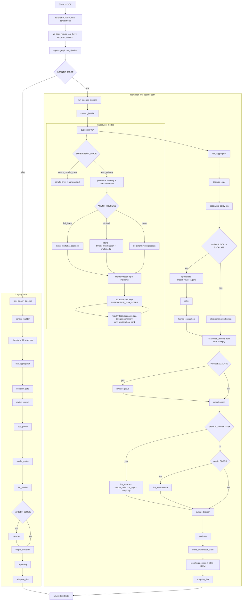

# SentinelGuard — Current Implementation (Detailed)

This document captures the **as-implemented** system behavior in the current codebase, including the Nemotron-first agentic flow, deterministic safety gates, storage model, APIs, and developer runbook.

Primary orchestrator source of truth: `backend/app/agents/graph.py`.

---

## 1) System overview

SentinelGuard is an OpenAI-compatible gateway that intercepts `POST /v1/chat/completions`, runs security orchestration and policy checks, then returns an OpenAI-shaped response plus `sentinel` metadata.

Key runtime mode:
- `AGENTIC_MODE=true` (default): Nemotron-first Sentinel-X path
- `AGENTIC_MODE=false`: legacy fixed linear path

---

## 2) Detailed end-to-end flow chart (current implementation)



---

## 3) Nemotron-first supervisor behavior

File: `backend/app/agents/supervisor.py`

### Modes
- `react_primary` (default): Nemotron-driven loop
- `legacy_parallel_crew`: old parallel specialists + bounded optional ReAct

### Prescan options (`AGENT_PRESCAN`)
- `full_threat`: runs `threat.run` once (legacy 11 scanner parity)
- `minimal`: runs intent + threat_investigation + multimodal specialists
- `none`: no deterministic prescan before LLM loop

### ReAct loop (primary mode)
- Uses `acomplete_with_tools` against `VLLM_PLANNER_MODEL`
- Iterates up to `SUPERVISOR_MAX_STEPS`
- Appends rich telemetry into `state.agent_steps` (phase/step/tool/latency/model_used)
- Terminal tool is expected to be `emit_explanation_card` (stored in `state.explanation_draft`)
- JSON fallback supported via `parse_react_json`

---

## 4) Tool surface available to Nemotron

File: `backend/app/agents/tools/registry.py`

Supervisor tool list includes:
- Specialist delegates:
  - `delegate_to_intent`
  - `delegate_to_threat`
  - `delegate_to_policy`
  - `delegate_to_multimodal`
  - `delegate_to_model_router`
  - `delegate_to_human_escalation`
- Deterministic scanner tools:
  - `run_full_input_scan`
  - `scan_pii`
  - `scan_secrets`
  - `scan_injection`
  - `scan_toxicity`
  - `scan_malware`
  - `check_rbac`
  - `scan_code_ip`
  - `scan_internal`
  - `scan_nhi`
  - `recall_similar` (vector recall scanner)
- Memory/policy tools:
  - `memory_recall_similar` (episodic memory)
  - `opa_evaluate`
- Terminal explanation tool:
  - `emit_explanation_card`

Implementation wrappers: `backend/app/agents/tools/security.py`.

---

## 5) Memory implementation (current)

File: `backend/app/agents/memory/episodic.py`

- `recall_similar_incidents_vector(text, k)`:
  - Embeds prompt text
  - Uses pgvector similarity against `requests.embedding`
  - Filters historical `BLOCK`/`ESCALATE` rows
  - Returns top-k incidents with similarity + prompt preview
- Supervisor injects this memory summary into the Nemotron user payload before loop execution.

---

## 6) Deterministic safety ceiling (non-negotiable path)

Even in Nemotron-first mode, final enforcement stays deterministic:
1. `risk_aggregator` computes score from `state.findings`
2. `decision_gate` maps risk to verdict tiers + hard rules
3. Policy pass (`specialists/policy.py`) applies OPA and contextual logic

This ensures the LLM can orchestrate and reason, but cannot bypass deterministic guardrails silently.

---

## 7) Data model and persistence

File: `backend/app/db/models.py`

Core tables:
- `users`, `sessions`
- `requests` (includes `embedding` vector)
- `findings` (input/output)
- `policies`
- `review_queue`
- `risk_graph_nodes`, `risk_graph_edges`
- `jailbreak_embeddings`
- `audit_events`
- `agent_traces` (agent_steps, assistant_steps, explanation, agent_findings)

Persistence path: `backend/app/agents/reporting.py`
- Writes request + findings + audit + `AgentTrace`
- Publishes Redis stream event (`sentinelguard:events`)
- Optional SIEM webhook fanout

---

## 8) APIs and runtime entry points

File: `backend/app/main.py`

Mounted routers:
- `/v1/chat/completions` → `api/chat.py`
- `/api/events/stream` → `api/events.py`
- `/api/review/*` → `api/review.py`
- `/api/policies/*` → `api/policies.py`
- `/api/analytics/*` → `api/analytics.py`
- `/health`, `/`

Auth + context headers:
- Required: `X-Sentinel-Key`
- Optional context: `X-User-Id`, `X-User-Tier`, `X-Session-Id`, `X-User-Region`, `X-Sensitivity`, `X-User-Role`, `X-Resource`, `X-Auth-Type`

---

## 9) Configuration reference (important current keys)

File: `backend/app/core/config.py` and `.env.example`

### LLM / vLLM
- `VLLM_BASE_URL`
- `VLLM_API_KEY`
- `VLLM_PLANNER_MODEL`
- `VLLM_ASSISTANT_MODEL`
- `VLLM_CRITIC_MODEL`
- `VLLM_JUDGE_MODEL`
- `VLLM_TOOL_CALLING_MODE`
- `ALLOW_CLOUD_FALLBACK`

### Agentic supervisor
- `AGENTIC_MODE`
- `SUPERVISOR_MODE`
- `AGENT_PRESCAN`
- `SUPERVISOR_MAX_STEPS`
- `MEMORY_RECALL_TOP_K`
- Legacy compat: `MAX_SUPERVISOR_STEPS`

### Output/reflection controls
- `MAX_REFLECTIONS`
- `MAX_OUTPUT_RETRIES`

### Infrastructure
- `DATABASE_URL`
- `REDIS_URL`
- `OPA_URL`
- `CODE_SANDBOX_URL`
- `SIEM_WEBHOOK_URL`
- `SENTINEL_API_KEY`

---

## 10) Frontend surfaces for this implementation

Routes under `frontend/app`:
- `/` dashboard
- `/sandbox`
- `/review`
- `/analytics`
- `/policies`
- `/logs`
- `/agent-trace`

`/agent-trace` consumes the enriched `sentinel` payload (`agent_steps`, findings, explanation) emitted by backend reporting.

---

## 11) Developer runbook (quick)

### Start full stack
```bash
cp .env.example .env
docker compose up --build
```

### Seed jailbreak embeddings
```bash
make seed
```

### Backend local dev
```bash
cd backend
uv sync --extra dev
uv run uvicorn app.main:app --reload --host 0.0.0.0 --port 8000
```

### Frontend local dev
```bash
cd frontend
pnpm install
pnpm dev
```

### Focused Nemotron tests
```bash
cd backend
uv run pytest tests/test_nemotron_supervisor.py -q
```

---

## 12) Related docs

- `docs/DEVELOPER_GUIDE.md`
- `docs/architecture.md`
- `docs/sentinel-x-agentic-workflow.md`
- `docs/flows/sentinel-x-agentic-pipeline.html`
- `docs/deployment.md`

---

If orchestration behavior changes, update this file and `docs/sentinel-x-agentic-workflow.md` together.

