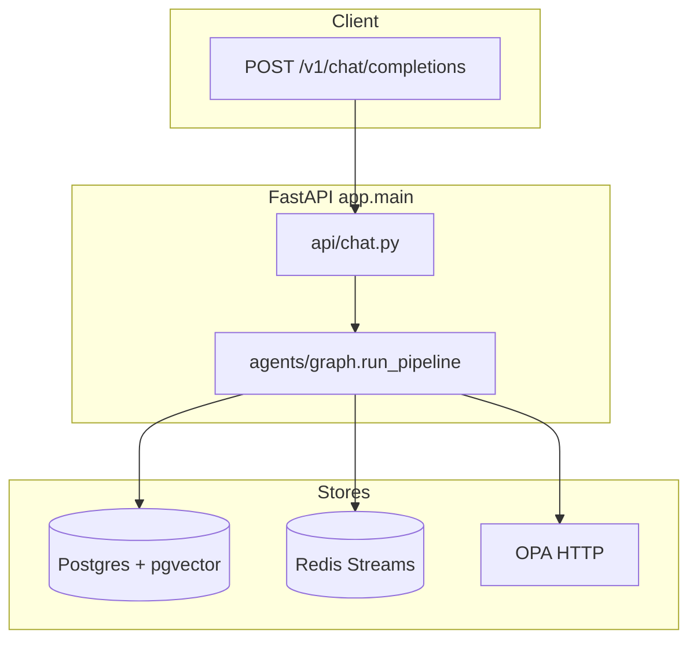

# Developer guide — SentinelGuard / Sentinel-X

This document orients **new contributors** to the current implementation: tech stack, repository layout, request lifecycle, configuration, and where to change behavior safely. Keep it alongside **[architecture.md](./architecture.md)** (system design), **[sentinel-x-agentic-workflow.md](./sentinel-x-agentic-workflow.md)** (agentic pipeline detail), and the **[visual flowchart](./flows/sentinel-x-agentic-pipeline.html)** (browser/SVG).

---

## 1. What you are working on

**SentinelGuard** is an **OpenAI-compatible HTTP gateway** that sits between clients and upstream LLMs. Every `POST /v1/chat/completions` runs through security scanners, risk scoring, policy checks, and (by default) a **Sentinel-X** multi-agent pipeline before returning a response. Responses include a **`sentinel`** object with verdicts, risk, findings, and (in agentic mode) explanation/trace metadata.

**Dual pipeline:** `AGENTIC_MODE=true` (default) uses `run_agentic_pipeline`; `false` uses a simpler linear `run_legacy_pipeline`. Both are implemented in **`backend/app/agents/graph.py`**.

---

## 2. Technology stack

### 2.1 Backend (Python 3.11+)

| Technology | Role in this project |
|------------|---------------------|
| **FastAPI** | HTTP API, OpenAPI docs at `/docs` |
| **Uvicorn** | ASGI server |
| **Pydantic v2** | `ScanState`, request/response models |
| **pydantic-settings** | Environment-based **`Settings`** (`core/config.py`) |
| **SQLAlchemy 2 (async)** | ORM; **`asyncpg`** driver |
| **Alembic** | Migrations under `backend/alembic/` (often used with `create_all` in dev) |
| **PostgreSQL 16 + pgvector** | Relational data + 384-dim embeddings (`requests.embedding`, `jailbreak_embeddings`) |
| **Redis** | Streams (`sentinelguard:events` for SSE); HITL coordination keys |
| **LiteLLM** | Unified LLM calls (OpenAI-compatible APIs, including **vLLM**) |
| **LangGraph / LangChain Core** | Present for workflow experiments; primary orchestration is **plain async** in `graph.py` |
| **structlog** | Structured logging |
| **httpx** | HTTP client (OPA, webhooks, sandbox) |
| **sse-starlette** | Server-Sent Events for `/api/events/stream` |
| **Open Policy Agent (Rego)** | External sidecar; policies in **`infra/opa/policies/`** |
| **Presidio** | PII analyzer/anonymizer |
| **detect-secrets** | Secret scanning |
| **spaCy** (+ **en_core_web_lg** when installed) | NLP support where used |
| **sentence-transformers** | Embeddings (`all-MiniLM-L6-v2`-style, 384 dims) |
| **Detoxify** / toxicity stack | Via scanners (see `scanners/toxicity.py`) |
| **NumPy**, **pgvector** Python bindings | Vector types |
| **Tenacity** | Retries where wired |
| **PyPDF**, **python-docx**, **Pillow**, **pytesseract** | Optional attachment extraction/OCR (`services/file_extract.py`) |
| **pytest**, **pytest-asyncio**, **ruff** | Tests and lint (dev extras) |
| **OpenTelemetry** (optional extra) | Stub/hooks in **`otel.py`** |
| **uv** | Recommended package runner (`uv sync`, `uv run`) |

Packaging: **`pyproject.toml`** + **hatchling**; application package is **`app`** under `backend/app/`.

### 2.2 Frontend

| Technology | Role |
|------------|------|
| **Next.js 15** (App Router) | Routes under `frontend/app/` |
| **React 19** | UI |
| **TypeScript ~5.6** | Types |
| **Tailwind CSS 3** | Styling |
| **Framer Motion** | Animations |
| **Recharts** | Charts on analytics |
| **lucide-react** | Icons |
| **pnpm** / **npm** | Install (`pnpm dev` per Makefile) |

### 2.3 Infrastructure (Docker)

| Service | Image / build | Purpose |
|---------|----------------|--------|
| **backend** | `backend/Dockerfile` | FastAPI app |
| **frontend** | `frontend/Dockerfile` | Next.js |
| **postgres** | `pgvector/pgvector:pg16` | Primary DB |
| **redis** | `redis:7-alpine` | Streams + queues |
| **opa** | `openpolicyagent/opa:0.68.0` | Policy API `:8181` |
| **code-sandbox** | `infra/sandbox/Dockerfile` | Optional isolated execution (`CODE_SANDBOX_URL`) |

Defined in **`docker-compose.yml`** at repo root.

---

## 3. Repository layout (what matters first)

```
Agentic ai/
├── docker-compose.yml          # Full stack
├── Makefile                    # up, seed, test, backend-dev, frontend-dev
├── .env.example                # Copy to .env — reference for all env vars
├── datasets/                   # Jailbreak / eval datasets (mounted read-only in backend)
├── docs/                       # Architecture, workflow, THIS guide, flow HTML
├── infra/
│   ├── opa/policies/           # *.rego + data.json — loaded by OPA container
│   ├── postgres/init.sql       # DB bootstrap (extension, etc.)
│   └── sandbox/                # Code-sandbox service
├── backend/
│   ├── pyproject.toml
│   ├── alembic/                # Migrations
│   ├── tests/                  # pytest
│   ├── infra/seed_jailbreaks.py   # Seed jailbreak embeddings (via Makefile)
│   └── app/
│       ├── main.py             # FastAPI app, routers, lifespan (DB init, vLLM probe)
│       ├── api/                # chat, events, review, policies, analytics, deps
│       ├── agents/             # Pipeline: graph.py, supervisor, specialists, tools, …
│       ├── scanners/           # Input/output detectors
│       ├── core/               # config, risk, policies (OPA client), logging, routing
│       ├── llm/                # litellm_client, vllm_probe, vllm_state
│       ├── db/                 # models, session, risk_graph helpers
│       ├── schemas/            # sentinel, explanation, openai shapes
│       └── services/           # e.g. file extraction
└── frontend/
    ├── app/                    # Pages: /, sandbox, review, analytics, policies, logs, agent-trace
    ├── components/
    └── lib/                    # api helpers, SSE hooks
```

---

## 4. Request lifecycle (mental model)

### 4.1 Entry point

1. Client sends **`POST /v1/chat/completions`** with **`X-Sentinel-Key`** (must match `SENTINEL_API_KEY`).
2. Optional identity headers:** `X-User-Id`, `X-User-Tier`, `X-Session-Id`, `X-User-Region`, `X-Sensitivity`, `X-User-Role`, `X-Resource`, … — parsed in **`api/deps.py`** → **`UserContext`**.
3. **`api/chat.py`** builds **`ScanState`** and awaits **`run_pipeline`** from **`agents/graph.py`**.

### 4.2 Orchestration

- **`run_pipeline`** → if **`agentic_mode`** → **`run_agentic_pipeline`**, else **`run_legacy_pipeline`**.
- Agentic path: context → **SupervisorAgent** (parallel specialists + optional vLLM ReAct) → risk → decision gate → **PolicyAgent** (OPA + optional LLM nuance) → conditional router/critic/human_escalation → optional **review_queue** → LLM + **output_reflection** loop → **assistant** → **`build_explanation_card`** → **reporting** (persists **`AgentTrace`**) → **adaptive_risk**.

**Detailed narrative + Mermaid:** [sentinel-x-agentic-workflow.md](./sentinel-x-agentic-workflow.md)

**Vertical SVG flow (open in browser, export PDF/PNG):** [flows/sentinel-x-agentic-pipeline.html](./flows/sentinel-x-agentic-pipeline.html)

### 4.3 Diagram (high level)



---

## 5. Core concepts

### 5.1 `ScanState`

Single mutable state object (**`backend/app/schemas/sentinel.py`**) passed through every step: prompts, **`findings`**, **`risk`**, **`verdict`**, model selection, LLM outputs, agentic **`agent_steps`**, **`explanation`**, etc. Agents usually return **`ScanState`** or mutate in place depending on the function — follow existing patterns in **`graph.py`**.

### 5.2 Agents vs scanners

- **Scanners** (`scanners/`): pure detection → **`Finding`** list.
- **Agents** (`agents/`): orchestration nodes — call scanners, OPA, LLM, other agents.
- **Specialists** (`agents/specialists/`): intent, threat, policy, multimodal, router, human escalation — used heavily in agentic mode.
- **Supervisor** (`agents/supervisor.py`): runs parallel crew + optional tool-calling loop; **`tools/registry.py`** dispatches **`delegate_to_*`** and **`emit_explanation_card`**.

### 5.3 Risk and verdicts

- **`core/risk.py`**: aggregates findings → score **0–100**; **`to_verdict`** maps thresholds from **`Settings`** (`RISK_ALLOW_MAX`, …).
- **`decision_gate.py`**: may override with **hard rules** (e.g. certain categories).

### 5.4 Policy

- **`core/policies.py`**: **`OPAClient`** — HTTP to OPA.
- **`infra/opa/policies/`**: Rego + **`data.json`** — tiers, regions, models.
- Agentic **PolicyAgent** adds optional **LLM nuance** when vLLM is configured.

### 5.5 Nemotron-first supervisor (default)

When **`SUPERVISOR_MODE=react_primary`** (default):

1. **Prescan** — **`AGENT_PRESCAN`**: `full_threat` runs the legacy **11-scanner** [`threat.run`](backend/app/agents/threat.py) once; `minimal` runs parallel intent/threat/multimodal; `none` skips deterministic prescan (not recommended for production).
2. **Memory** — Top-k similar past **BLOCK/ESCALATE** requests are embedded from [`recall_similar_incidents_vector`](backend/app/agents/memory/episodic.py) (pgvector) and injected into the supervisor user prompt.
3. **Nemotron / vLLM loop** — [`supervisor.run_react_loop_primary`](backend/app/agents/supervisor.py) calls **`acomplete_with_tools`** up to **`SUPERVISOR_MAX_STEPS`** using [`OPENAI_SUPERVISOR_TOOLS`](backend/app/agents/tools/registry.py): delegates, **`run_full_input_scan`**, per-scanner tools, **`memory_recall_similar`**, **`opa_evaluate`**, **`emit_explanation_card`**, etc.
4. **Deterministic ceiling unchanged** — [`risk_aggregator`](backend/app/agents/risk_aggregator.py) → [`decision_gate`](backend/app/agents/decision_gate.py) → PolicyAgent still run **after** the supervisor in [`graph.py`](backend/app/agents/graph.py); the LLM cannot silently remove scanner findings.

Set **`SUPERVISOR_MODE=legacy_parallel_crew`** to restore the older parallel-crew + narrow ReAct behavior.

---

## 6. Extension points (where to implement features)

| Goal | Likely touch points |
|------|---------------------|
| New input detector | `scanners/new_scanner.py`, register in **`agents/threat.py`** (or specialist threat path) |
| New output detector | `scanners/`, **`agents/sanitizer.py`** |
| Change verdict thresholds | `.env` / **`core/config.py`**, **`core/risk.py`**, **`decision_gate.py`** |
| New OPA rule | `infra/opa/policies/*.rego`, **`data.json`**, redeploy/reload OPA |
| Change agentic order | **`agents/graph.py`** (careful with side effects) |
| New specialist tool | **`agents/tools/registry.py`** + **`agents/specialists/__init__.py`** `run_specialist` |
| API surface | **`main.py`** routers under **`api/`** |
| Dashboard page | **`frontend/app/<route>/page.tsx`** |

---

## 7. Local development

### 7.1 Full stack (Docker)

```bash
cp .env.example .env
docker compose up --build
```

- API: `http://localhost:8000` (docs: `/docs`)
- UI: `http://localhost:3000`
- OPA: `http://localhost:8181`

**Seed jailbreak embeddings** (when DB is up):

```bash
make seed
# Equivalent: docker compose exec backend python -m infra.seed_jailbreaks
```

### 7.2 Backend only (host)

From repo root:

```bash
make backend-dev
# Or: cd backend && uv sync && uv run uvicorn app.main:app --reload --host 0.0.0.0 --port 8000
```

Ensure **Postgres**, **Redis**, and **OPA** match **`DATABASE_URL`**, **`REDIS_URL`**, **`OPA_URL`** (often via Docker for those three only).

### 7.3 Frontend only

```bash
make frontend-dev
# Or: cd frontend && pnpm install && pnpm dev
```

Set **`NEXT_PUBLIC_API_URL`** to your backend (see `.env.example`).

### 7.4 Tests

```bash
cd backend && uv run pytest
# Or from host with compose: make test
```

Use **`uv sync --all-extras`** if tests need optional deps (e.g. observability). Some environments require **`aiosqlite`** or a valid **`DATABASE_URL`** for SQLite vs Postgres — align with **`tests/conftest.py`**.

### 7.5 Lint (backend)

```bash
cd backend && uv run ruff check app
```

---

## 8. Configuration (environment variables)

Authoritative template: **`.env.example`**. Highlights:

| Variable | Meaning |
|----------|---------|
| **VLLM_BASE_URL**, **VLLM_*_MODEL** | Primary LLM brain (OpenAI-compatible); optional vision model |
| **AGENTIC_MODE** | `true` = Sentinel-X pipeline |
| **SUPERVISOR_MODE** | `react_primary` (Nemotron-first) or `legacy_parallel_crew` |
| **AGENT_PRESCAN** | `full_threat` \| `minimal` \| `none` |
| **SUPERVISOR_MAX_STEPS** | Nemotron tool turns (default 16) |
| **MEMORY_RECALL_TOP_K** | Episodic snippets injected into supervisor prompt |
| **MAX_SUPERVISOR_STEPS** (legacy) | Short legacy ReAct only |
| **MAX_OUTPUT_RETRIES**, **MAX_REFLECTIONS** | Output / reflection limits |
| **DATABASE_URL** | Async SQLAlchemy URL (`postgresql+asyncpg://…`) |
| **REDIS_URL** | Redis for streams/HITL |
| **OPA_URL** | OPA sidecar |
| **CODE_SANDBOX_URL** | Isolated code runner |
| **SENTINEL_API_KEY** | Must match **`X-Sentinel-Key`** |
| **RISK_*_MAX** | Score thresholds |
| **ALLOW_CLOUD_FALLBACK** | Allow non-vLLM cloud keys via LiteLLM when configured |

---

## 9. Observability and debugging

- **Structured logs**: **`core/logging.py`** — correlate by **`request_id`** on **`ScanState`**.
- **Redis stream**: **`agents/reporting.py`** publishes events consumed by **`api/events.py`** SSE.
- **Postgres**: **`requests`**, **`findings`**, **`audit_events`**, **`agent_traces`** — replay traces for Agent Trace UI when wired.
- **OpenTelemetry**: optional **`observability`** extra + **`otel.py`** — extend as needed.

---

## 10. Security notes for contributors

- Treat **`X-Sentinel-Key`** as the **gate-level secret**; do not log it.
- **Sandbox** and **assistant** tools must stay constrained — review **`agents/tools/security.py`** and sandbox **`infra/sandbox/`**.
- **OPA** is the declarative policy layer; avoid bypassing it for tenant-facing decisions without review.

---

## 11. Documentation index

| Doc | Use when |
|-----|----------|
| **[DEVELOPER_GUIDE.md](./DEVELOPER_GUIDE.md)** (this file) | Onboarding, stack, layout, dev workflow |
| **[architecture.md](./architecture.md)** | System architecture, components, data stores |
| **[sentinel-x-agentic-workflow.md](./sentinel-x-agentic-workflow.md)** | Agentic pipeline step-by-step |
| **[flows/sentinel-x-agentic-pipeline.html](./flows/sentinel-x-agentic-pipeline.html)** | Printable vertical flowchart |
| **[PROJECT_OVERVIEW.md](./PROJECT_OVERVIEW.md)** | Long-form product narrative |
| **[deployment.md](./deployment.md)** | Deployment |
| **[demo-script.md](./demo-script.md)** | Demo walkthrough |
| **[README.md](../README.md)** | Quick start |

---

## 12. Checklist for your first PR

1. Read **`graph.py`** and one agent file end-to-end.
2. Run **`docker compose up`** or **`make backend-dev`** with dependencies.
3. Hit **`POST /v1/chat/completions`** with **`curl`** or OpenAPI **`/docs`**.
4. Run **`pytest`** and **`ruff`** on touched backend code.
5. If you changed behavior, update **`docs/`** (this guide, architecture, or workflow) in the same PR when user-visible.

Welcome aboard — when in doubt, **`ScanState`** + **`graph.py`** are the source of truth for control flow.
