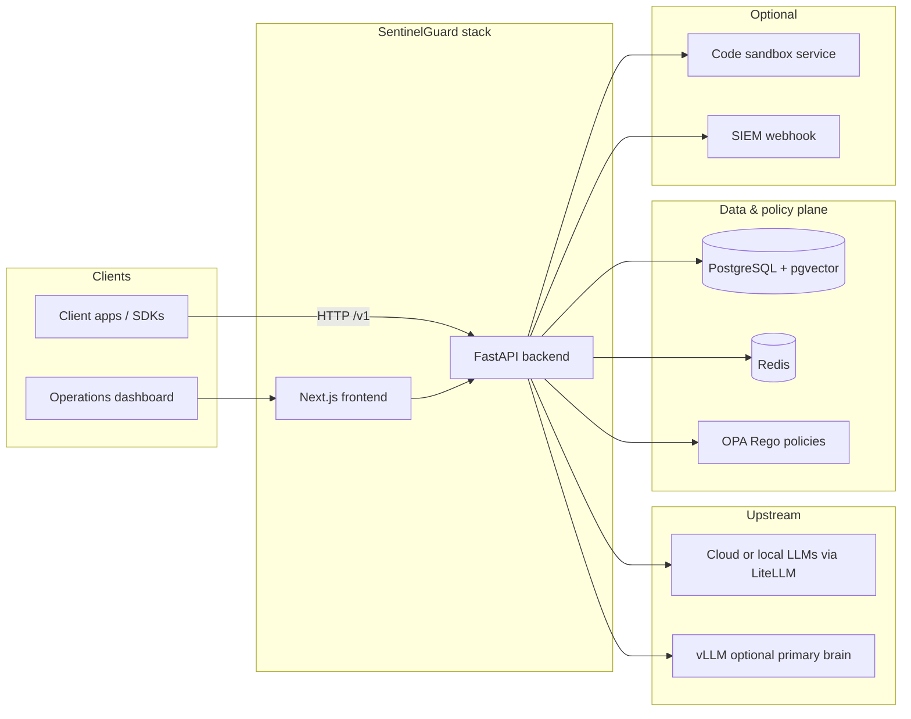
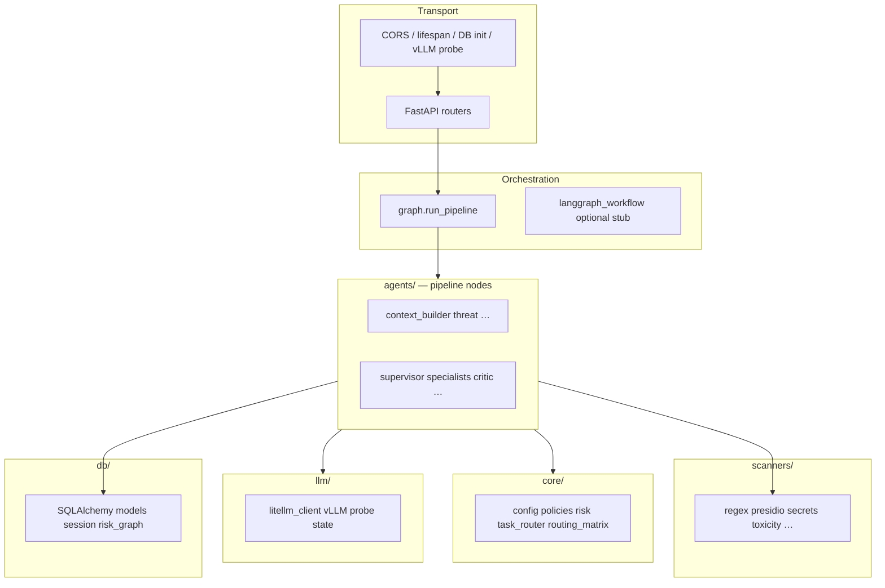
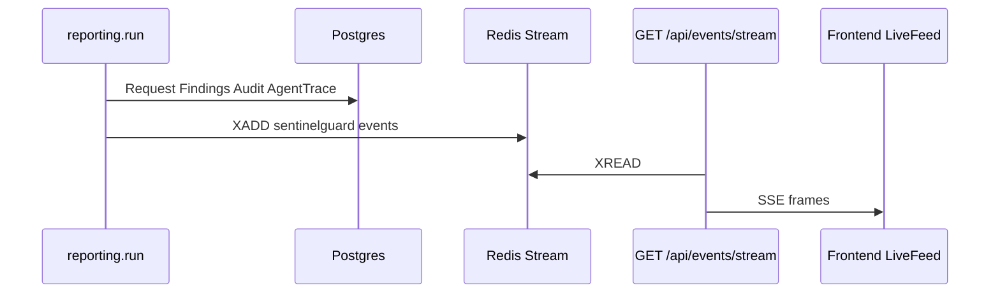

# SentinelGuard — detailed architecture

This document is the **canonical technical architecture** for the repository: how components connect, where logic lives, and how requests flow. For the **step-by-step agentic (Sentinel-X) pipeline**, see also **[sentinel-x-agentic-workflow.md](./sentinel-x-agentic-workflow.md)**.

---

## 1. Purpose and positioning

**SentinelGuard** is an **OpenAI-compatible HTTP gateway** that fronts upstream LLMs. Each chat completion runs through defense-in-depth checks (scanners, risk aggregation, policy, optional multi-agent orchestration) before and after model inference. Clients point their OpenAI base URL at SentinelGuard; responses stay compatible and gain a **`sentinel`** provenance block.

---

## 2. System context (C4 Level 1)

---

## 3. Deployable containers (`docker-compose.yml`)

| Service | Role | Typical exposure |
|--------|------|------------------|
| **backend** | FastAPI app, full pipeline | `:8000` |
| **frontend** | Next.js UI | `:3000` |
| **postgres** | pgvector-enabled Postgres 16 | host port often `:5433` |
| **redis** | Streams for live events; review coordination | `:6379` |
| **opa** | Policy evaluation API | `:8181` |
| **code-sandbox** | Isolated code execution (internal URL `CODE_SANDBOX_URL`) | internal only |

Environment wiring is centralized in **`backend/app/core/config.py`** and `.env` (see `.env.example`).

---

## 4. Backend layering

### 4.1 API surface (`backend/app/api/`)

| Router | Responsibility |
|--------|----------------|
| **`chat.py`** | `POST /v1/chat/completions` — builds `UserContext`, runs **`run_pipeline`**, returns OpenAI-shaped JSON + **`sentinel`** payload |
| **`events.py`** | SSE over Redis stream `sentinelguard:events` |
| **`review.py`** | HITL queue list / decisions |
| **`policies.py`** | Policy CRUD + suggested policies |
| **`analytics.py`** | Summary, charts data |
| **`deps.py`** | API key (`X-Sentinel-Key`), user headers |

Mounted from **`main.py`** under `/v1`, `/api`, etc.

### 4.2 Orchestration (`backend/app/agents/graph.py`)

All business journeys converge on **`run_pipeline`**, which branches:

| Mode | Flag | Implementation |
|------|------|----------------|
| **Legacy linear DAG** | `AGENTIC_MODE=false` | `run_legacy_pipeline` — fixed sequence: context → threat → risk → gate → review → OPA → router → LLM → sanitizer → output_decision → reporting → adaptive |
| **Sentinel-X agentic** | `AGENTIC_MODE=true` (default) | `run_agentic_pipeline` — supervisor + specialists, expanded policy path, critic, human escalation, LLM loop with **output reflection**, **assistant**, **ExplanationCard**, **`AgentTrace`** persistence |

Details and diagrams: **[sentinel-x-agentic-workflow.md](./sentinel-x-agentic-workflow.md)**.

### 4.3 Specialist and tooling modules

Agentic mode adds composable pieces under:

| Area | Location |
|------|----------|
| Supervisor | `agents/supervisor.py` |
| Specialists (intent, threat, policy, multimodal, router, human escalation) | `agents/specialists/` |
| Multimodal sub-agents | `mm_image.py`, `mm_document.py`, `mm_url.py`, `mm_metadata.py` |
| Tool registry & OpenAI tool schemas | `agents/tools/registry.py`, `security.py` |
| Output reflection specialist wrapper | `agents/specialists/output_reflection_agent.py` |
| Explanation assembly | `agents/explanation_builder.py` |
| Sandboxed execution | `agents/sandbox/runner.py` |
| Memory hooks | `agents/memory/episodic.py` |
| ReAct JSON fallback | `agents/parsers/react_json.py` |

Legacy **`agents/threat.py`** still fans out **input scanners** in parallel; **`agents/sanitizer.py`** runs **output scanners**. Those remain shared infrastructure regardless of mode.

---

## 5. Shared domain model: `ScanState`

Defined in **`backend/app/schemas/sentinel.py`**. Every pipeline step reads/writes the same mutable **`ScanState`** (Pydantic model — agents typically use **`model_copy`** for controlled updates).

Notable fields:

| Group | Examples |
|-------|----------|
| Identity / request | `request_id`, `user`, `prompt`, `attachments`, `sensitivity`, `requested_model` |
| Detection | `findings`, `risk`, `risk_breakdown`, `verdict`, `block_reason` |
| Policy | `opa_allowed`, `opa_reasons`, `allowed_models`, `selected_model`, `fallback_chain` |
| Model output | `llm_response`, `final_response`, `output_findings`, `output_verdict` |
| Sentinel-X | `agent_steps`, `agent_findings`, `explanation`, `explanation_draft`, `reflections`, `confidence`, `self_corrections`, `rewrite_constraints`, `agentic_trace_version` |

**Verdicts:** input-side `Verdict` (`ALLOW` / `MASK` / `ESCALATE` / `BLOCK`); output-side **`OutputVerdict`** (`CLEAN` / `REDACT` / `BLOCK`).

---

## 6. Risk engine (`backend/app/core/risk.py`)

- **Aggregation:** per-category **weights** × finding **severity**, plus a small **multi-scanner bonus** and **historical user risk** term → clamped **0–100**.
- **Thresholds** (env-tunable via `RISK_ALLOW_MAX`, `RISK_MASK_MAX`, `RISK_ESCALATE_MAX`): map score → **`Verdict`** via **`to_verdict`**.
- **Decision gate** (`agents/decision_gate.py`) may apply **hard rules** (e.g. critical categories) overriding pure score behavior.

Category weights include high emphasis on injection classes, secrets, malware, RBAC/NHI, etc. (see `CATEGORY_WEIGHTS` in code).

---

## 7. Scanners (`backend/app/scanners/`)

Scanners implement a common pattern: consume text/context → emit **`Finding`** records (category, severity, scanner id, evidence). They are orchestrated from **`threat.py`** (input) and **`sanitizer.py`** (output).

Representative scanners:

| Scanner | Typical use |
|---------|-------------|
| `regex_rules` | Fast injection / role-override patterns |
| `presidio_pii` | PII entities |
| `secrets_scan` | credentials |
| `toxicity` | abusive content |
| `embedding_jailbreak` | similarity to jailbreak corpus |
| `vector_recall` | pgvector similarity to past incidents |
| `llm_judge` | borderline tie-breaker when configured |
| `rbac`, `nhi_check`, `internal_info`, `malware_request` | contextual policy checks |
| Output: `dangerous_code`, `citation_validator`, `policy_violation`, etc. | response-side |

Embeddings use **sentence-transformers** (`all-MiniLM-L6-v2`, 384 dimensions) aligned with **`Vector(384)`** columns.

---

## 8. Policy layer: OPA + application client

- **Rego bundles** live under **`infra/opa/policies/`** (`sentinel.rego`, `models.rego`, plus Sentinel-X additions such as `access.rego`, `compliance.rego`, `intent.rego`, `tools.rego`) with **`data.json`** for static data.
- **`backend/app/core/policies.py`** exposes **`OPAClient`**: HTTP calls to OPA for allow/deny, model allowlists, and packaged decisions used by **`agents/opa_policy.py`** and specialist **`policy`** agent.
- Agentic **PolicyAgent** may apply **LLM-assisted contextual interpretation** when configured (`VLLM_BASE_URL`), without contradicting hard malware/outright deny paths (see implementation).

---

## 9. LLM integration (`backend/app/llm/`)

| Module | Role |
|--------|------|
| **`litellm_client.py`** | **`acomplete`**, **`acomplete_with_tools`**, **`adescribe_image`** — unified LiteLLM entry; supports **OpenAI-compatible vLLM** via `api_base` + `openai/<model>` naming |
| **`vllm_probe.py` / `vllm_state.py`** | Startup probe; records whether native tool calling vs JSON fallback is viable |

Configuration highlights: **`VLLM_BASE_URL`**, planner/assistant/critic model names, **`AGENTIC_MODE`**, retry/planner limits. Cloud keys remain optional behind **`ALLOW_CLOUD_FALLBACK`**.

---

## 10. Data architecture (`backend/app/db/models.py`)

Tables (SQLAlchemy; **`init_db`** uses `create_all` + pgvector extension):

| Table | Purpose |
|-------|---------|
| `users` | Identity, tier, region, EWMA **`risk_score`** |
| `sessions` | Session stats |
| `requests` | One row per completion; prompts, responses, risk, verdicts, **`embedding`** for recall |
| `findings` | Normalized scanner findings (input/output side) |
| `policies` | Active and AI-suggested Rego policies |
| `review_queue` | HITL items |
| `risk_graph_nodes`, `risk_graph_edges` | Adaptive risk graph |
| `jailbreak_embeddings` | Corpus vectors |
| `audit_events` | Append-only audit stream |
| **`agent_traces`** | **Sentinel-X:** persisted **`agent_steps`**, **`assistant_steps`**, **`explanation`**, **`agent_findings`** for replay/trace UI |

Helpers: **`db/risk_graph.py`** for graph upserts.

---

## 11. Async events and integrations

Optional **SIEM**: **`reporting.py`** POSTs compact payloads when **`SIEM_WEBHOOK_URL`** is set.

---

## 12. Frontend (`frontend/`)

| Area | Stack |
|------|--------|
| Framework | Next.js (App Router), React, TypeScript |
| Styling | Tailwind |
| Live data | SSE client (`lib/sse.ts` pattern), fetch helpers (`lib/api.ts`) |

**Routes** (under `frontend/app/`): home dashboard, sandbox, review, analytics, policies, logs, **agent-trace**. **`Nav.tsx`** links primary sections.

The UI consumes **`NEXT_PUBLIC_API_URL`** and sends **`X-Sentinel-Key`** (and user headers where applicable).

---

## 13. Cross-cutting concerns

| Concern | Where |
|---------|--------|
| **Configuration** | `core/config.py`, `.env` |
| **Structured logging** | `core/logging.py` |
| **OpenTelemetry stub** | `otel.py` (optional instrumentation) |
| **Task routing** | `task_router.py`, `routing_matrix.py` — task/complexity/tier-aware model preferences |
| **Auth** | API key on gateway; fine-grained identity via headers parsed in **`api/deps.py`** |
| **CORS** | `main.py` from **`CORS_ORIGINS`** |

---

## 14. Configuration matrix (representative)

| Env variable | Purpose |
|--------------|---------|
| `SENTINEL_API_KEY` | Gateway authentication |
| `DATABASE_URL` | Async SQLAlchemy URL |
| `REDIS_URL` | Streams + review |
| `OPA_URL` | OPA HTTP API |
| `AGENTIC_MODE` | Legacy vs Sentinel-X pipeline |
| `VLLM_BASE_URL`, `VLLM_*_MODEL` | Primary LLM / tools / vision |
| `CODE_SANDBOX_URL` | Optional isolated execution |
| `RISK_*_MAX` | Verdict thresholds |
| `MAX_OUTPUT_RETRIES`, `MAX_SUPERVISOR_STEPS` | Loops |

Full list: **`.env.example`**.

---

## 15. Testing and quality

- **`backend/tests/`** — pytest; pipeline, scanners, red-team style cases (`conftest.py` provides app/DB fixtures).
- **`backend/scripts/eval_agentic.py`** — evaluation harness for agentic metrics (when run with datasets).

---

## 16. Related documentation

| Document | Contents |
|----------|----------|
| **[DEVELOPER_GUIDE.md](./DEVELOPER_GUIDE.md)** | **Onboarding:** full tech stack, repo layout, lifecycle, env vars, extension points, first-PR checklist |
| **[sentinel-x-agentic-workflow.md](./sentinel-x-agentic-workflow.md)** | Sentinel-X stages, supervisor, explanation cards, trace persistence |
| **[flows/sentinel-x-agentic-pipeline.html](./flows/sentinel-x-agentic-pipeline.html)** | Visual vertical flowchart (SVG in HTML; print/export to PDF or PNG) |
| **[PROJECT_OVERVIEW.md](./PROJECT_OVERVIEW.md)** | Product narrative, long tutorial-style walkthrough |
| **[deployment.md](./deployment.md)** | Deployment patterns |
| **[README.md](../README.md)** | Quick start |

---

## 17. Architectural principles (summary)

1. **Single state object** (`ScanState`) across all nodes — easy testing and tracing.
2. **Two pipelines** behind one entry (`run_pipeline`) — safe rollback to legacy behavior.
3. **Parallel scanners** on hot paths; expensive ML/judge paths gated by score bands.
4. **Policy separation** — OPA for declarative rules; optional LLM nuance layered in agentic mode.
5. **Observable by design** — Redis stream for UI, Postgres for audit/replay, optional SIEM.
6. **Provider-agnostic LLM** — LiteLLM + optional self-hosted vLLM as first-class.

---

*This file should stay aligned with `backend/app/agents/graph.py`, `main.py`, `docker-compose.yml`, and `db/models.py`. When you change pipeline topology or services, update §4–§11 accordingly.*
