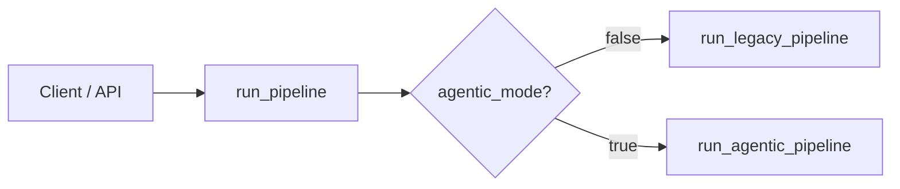
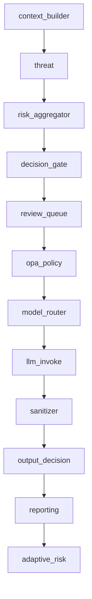
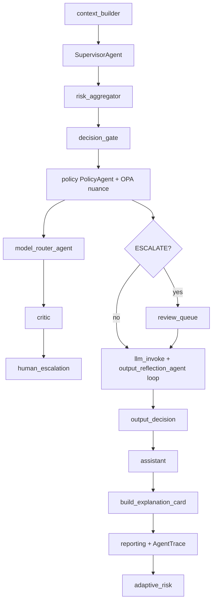
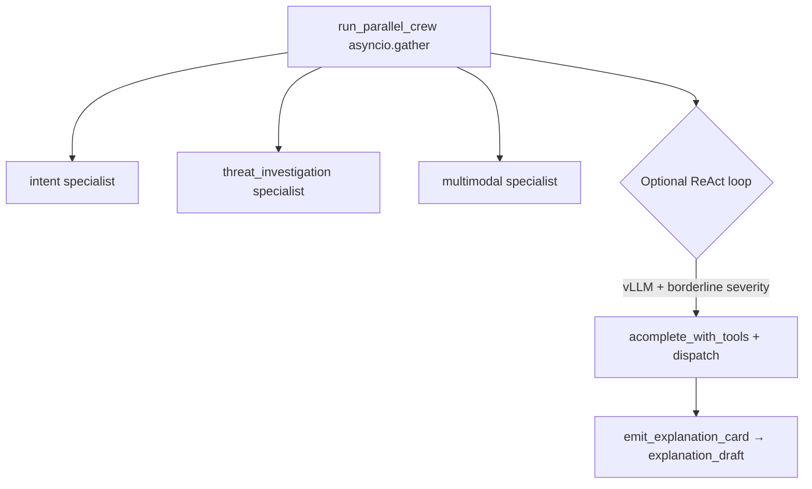
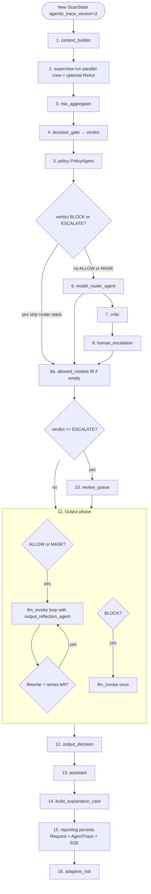
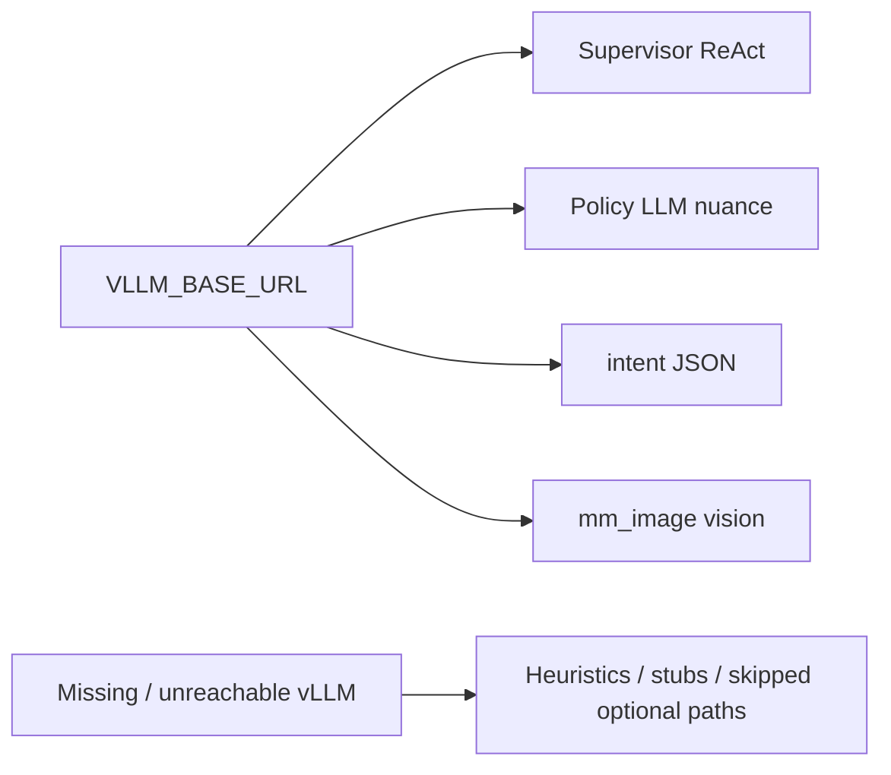

# Sentinel-X agentic workflow

This document describes the **current** request pipeline implemented in the codebase: entry points, configuration, data flowing through `ScanState`, and how the **legacy linear DAG** differs from the **Sentinel-X agentic path** (`AGENTIC_MODE=true`, default).

Primary implementation: [`backend/app/agents/graph.py`](../backend/app/agents/graph.py).

**Standalone vertical flow diagram (HTML + SVG, browser / PDF / screenshot):** [`docs/flows/sentinel-x-agentic-pipeline.html`](flows/sentinel-x-agentic-pipeline.html)

**Nemotron-first mode:** With `SUPERVISOR_MODE=react_primary` (default), the supervisor runs optional **`AGENT_PRESCAN`** (`full_threat` = legacy `threat.run`), injects **pgvector episodic memory** into the prompt, then runs the **vLLM tool loop** (see [`registry.py`](../backend/app/agents/tools/registry.py)) before the same deterministic **risk → gate → policy** chain.

---

## 1. Entry and routing

| Setting | Env var | Default | Meaning |
|--------|---------|---------|---------|
| Agentic mode | `AGENTIC_MODE` | `true` | Use `run_agentic_pipeline`; `false` uses the fixed 11-step legacy DAG. |

---

## 2. High-level comparison

### 2.1 Legacy pipeline (`AGENTIC_MODE=false`)

Linear sequence; **no** specialist supervisor, **no** parallel intent/threat/multimodal crew (beyond what `threat.run` does internally), **no** `ExplanationCard`, **no** assistant phase as in agentic.

Note: `sanitizer` runs only when verdict ≠ `BLOCK`.

### 2.2 Agentic pipeline (`AGENTIC_MODE=true`)

Adds a **supervisor-orchestrated specialist phase**, **policy specialist** with expanded OPA layers, **critic**, **human escalation**, optional **review queue**, **LLM loop with output reflection / self-correction**, **assistant**, **ExplanationCard**, then persistence.

*(Branches for `BLOCK` / `ALLOW`/`MASK` are detailed in section 4.)*

---

## 3. Supervisor phase (detail)

Implemented in [`backend/app/agents/supervisor.py`](../backend/app/agents/supervisor.py).

**Parallel crew**

- **Intent** — classifies intent (JSON via LLM when vLLM configured).
- **Threat investigation** — scanner-backed findings on the prompt.
- **Multimodal** — routes work to sub-specialists: image (vision when bytes available), document heuristics, URL reputation stub, metadata/EXIF hints.

**Optional ReAct loop**

- Runs only if `VLLM_BASE_URL` is set **and** preliminary finding severities are in a **border band** (not trivially low nor extremely high — see code).
- Uses OpenAI-style tools from [`registry.get_supervisor_openai_tools()`](../backend/app/agents/tools/registry.py): delegate specialists, `scan_pii` / `scan_secrets`, **`emit_explanation_card`**.
- Tool calls go through [`dispatch()`](../backend/app/agents/tools/registry.py); `emit_explanation_card` stores **`state.explanation_draft`** for later merge into the final ExplanationCard.

**Tracing**

- Steps append to **`state.agent_steps`** (and supervisor adds structured entries).

---

## 4. Agentic graph: ordered stages

This mirrors **`run_agentic_pipeline`** in code order.

**Policy agent (`policy_spec.run`)**

- Evaluates base OPA, **access**, **compliance**, **intent rules** via [`OPAClient`](../backend/app/core/policies.py).
- May set **`verdict`** to `BLOCK` / `ESCALATE`.
- Optional **`_llm_contextual_nuance`**: when vLLM is configured, human review is suggested, and there is no outright deny / critical malware class, an LLM pass can align to `BLOCK` / `ESCALATE` and append a structured finding.

**When verdict is `BLOCK` or `ESCALATE`**

- **model_router_agent**, **critic**, **human_escalation** are **skipped** (see `if state.verdict not in (BLOCK, ESCALATE)`).

**Output loop (`ALLOW` / `MASK`)**

- Up to **`max_output_retries + 1`** attempts (`MAX_OUTPUT_RETRIES`, default 2).
- Each attempt: **`llm_invoke`** → **`output_reflection_agent`** (wraps core output reflection + blackboard finding).
- Verdict from reflection: **`CLEAN`** exits loop; **`BLOCK`** exits (may replace final text); **`REWRITE`** appends **`rewrite_constraints`** to prompt and increments **`self_corrections`** if retries remain.

**`BLOCK` without upstream assistant loop**

- Single **`llm_invoke`** (e.g. refusal path), then continues to **`output_decision`** → **`assistant`** → explanation → reporting.

---

## 5. Shared state and artifacts

| Concept | Where stored | Purpose |
|--------|----------------|---------|
| Findings | `state.findings`, `state.agent_findings` | Scanner + specialist blackboard |
| Risk | `state.risk`, `state.risk_breakdown` | Aggregated scores |
| Verdict | `state.verdict` | `ALLOW` / `MASK` / `ESCALATE` / `BLOCK` |
| Trace steps | `state.agent_steps` | Supervisor + graph steps for UI/SSE |
| Draft explanation | `state.explanation_draft` | From supervisor `emit_explanation_card` |
| Final explanation | `state.explanation` | Built by **`build_explanation_card`** |
| Persistence | `AgentTrace` row + `Request` | Replay / audit (`reporting.run`) |

[`build_explanation_card`](../backend/app/agents/explanation_builder.py) merges **`explanation_draft`** (headline, message, confidence when present) with pipeline truth (**verdict** from `ScanState`), policy summaries, and **`alternatives_considered`**.

---

## 6. Observability and UI

- **Reporting** publishes a compact payload (including **`sentinel.explanation`**, **`agent_steps`**, **`agent_findings`**) to Redis stream / SIEM when configured.
- Frontend **Agent Trace** consumes SSE/streamed structured fields where wired.

---

## 7. Related files (quick index)

| Area | Files |
|------|--------|
| Orchestration | `backend/app/agents/graph.py`, `supervisor.py` |
| Specialists | `backend/app/agents/specialists/*.py`, `mm_*.py` |
| Tools | `backend/app/agents/tools/registry.py`, `security.py` |
| OPA | `backend/app/core/policies.py`, `infra/opa/policies/*.rego` |
| LLM | `backend/app/llm/litellm_client.py`, `vllm_state.py` |
| Schemas | `backend/app/schemas/sentinel.py`, `explanation.py` |
| DB | `backend/app/db/models.py` (`AgentTrace`, `Request`, …) |

---

## 8. Diagram: config dependencies

This is **behavioral**: optional paths degrade gracefully; core gates (**decision_gate**, OPA allow/deny as implemented) still apply.

---

*Generated to match the repository layout at documentation time. For code-level truth, prefer `graph.py` and `supervisor.py`.*
